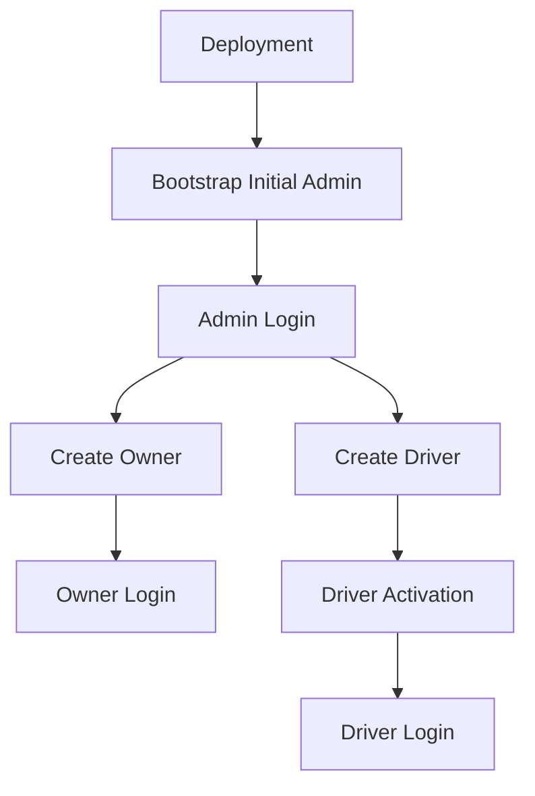
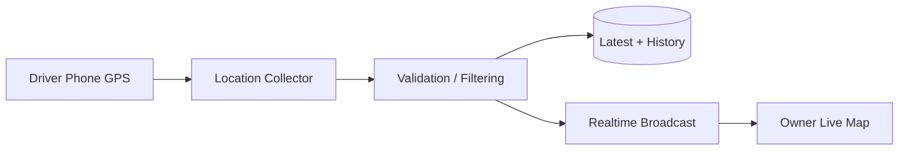

# Product Requirements Document (PRD)

**Product:** Distribution Management System  
**Version:** 1.1  
**Status:** Baseline Draft  
**Date:** 2026-08-30

## 1. Problem statement

Perusahaan distributor membutuhkan sistem internal untuk mengatur pengiriman barang menggunakan armada dan driver sendiri.

Kebutuhan utama:

- mengetahui posisi driver secara realtime menggunakan GPS dari HP driver;
- mengetahui delivery yang sedang dijalankan;
- mengatur urutan titik tujuan secara manual atau melalui rekomendasi/otomatisasi;
- mengetahui barang yang dibawa dan tujuan berikutnya;
- berkomunikasi Owner ↔ Driver;
- memiliki bukti pengiriman dan histori perjalanan;
- memiliki administrasi user dan audit terpusat.

Sistem **tidak menyediakan customer-facing tracking**.

## 2. Product vision

Menjadi pusat operasi distribusi perusahaan dari penugasan delivery hingga barang selesai dikirim, dengan visibilitas lokasi realtime, route management, komunikasi aman, proof of delivery, dan audit yang jelas.

## 3. Target users

### Admin

Mengelola user, role/permission, vehicle, konfigurasi, security, audit, dan operasi tingkat sistem.

### Owner

Mengawasi driver, membuat/mengelola delivery, memilih driver/vehicle, memonitor lokasi, mengatur route, dan berkomunikasi dengan driver.

### Driver

Menjalankan delivery, melihat barang/destination, memilih route yang diizinkan, mengirim GPS, memperbarui status, berkomunikasi, dan membuat proof of delivery.

## 4. Scope

### In scope

- Account lifecycle dan activation
- Authentication/session
- RBAC dan object-level authorization
- Owner Mobile
- Driver Mobile
- Admin Web
- Delivery/order/item/stop
- Driver/vehicle assignment
- Manual/recommended/automatic route
- GPS/location history
- Owner live map
- ETA/route state
- Geofence support
- Chat
- Push-to-talk
- Owner-requested live video
- Protected realtime communication
- Proof of Delivery
- Notifications
- Emergency/SOS
- Audit and structured logging
- Monitoring/observability
- Maps/routing integration

### Out of scope baseline

- customer app
- vehicle IoT
- fuel/engine/temperature telemetry
- public marketplace
- payment gateway
- fully autonomous dispatch
- custom cryptographic primitives

## 5. Product principles

1. Operational first.
2. Backend authoritative.
3. Least privilege.
4. Privacy/security by design.
5. Battery aware.
6. Auditable.
7. Provider agnostic where sensible.
8. Media realtime tidak boleh menjadi single point of failure delivery.
9. Cost aware.

## 6. Core journeys

### Bootstrap & account

### Delivery lifecycle

### Live tracking

## 7. Functional requirements by role

### Admin

- account lifecycle Owner/Driver;
- role/permission administration;
- vehicle management;
- audit review;
- configuration;
- system health/session overview;
- controlled emergency/override.

### Owner

- dashboard dan fleet map;
- driver status/location/current destination/ETA/progress;
- create/edit delivery;
- items and quantities;
- driver/vehicle assignment;
- stop order;
- route recommendation/manual/automatic mode;
- route/trip history;
- chat;
- push-to-talk;
- request live video;
- view POD;
- operational notifications;
- emergency view.

### Driver

- login/activation;
- view own deliveries;
- view items/destinations;
- route selection;
- GPS tracking during active operation;
- update delivery/stop status;
- navigation handoff;
- POD photo/signature/receiver;
- chat to Owner;
- receive authorized voice/video requests;
- SOS.

## 8. Security/product requirements

Private communications should be designed so that the backend does not receive plaintext chat and should not be an unnecessary trust point for media content. TLS/HTTPS/WSS is still mandatory for transport.

## 9. Success metrics

- delivery can be created, assigned, executed, and completed end-to-end;
- Owner sees fresh Driver location during active trip;
- driver can recover from temporary network loss without corrupting state;
- unauthorized role/resource access is rejected server-side;
- critical state changes produce audit records;
- communications pass security/realtime acceptance tests;
- deployment can be reproduced from documented configuration.

## 10. MVP priority

### P0 — Core

Auth, RBAC, user lifecycle, Admin Web, delivery, driver, vehicle, route mode, GPS ingestion, Owner map, POD, audit.

### P1 — Operational hardening

Offline/retry, geofence, notifications, reporting, security hardening.

### P2 — Realtime communication

E2EE chat integration, PTT, WebRTC video, media authorization.

Heavy media features must not block basic delivery completion.

## 11. Security and trust requirements

Security merupakan product requirement, bukan hanya implementasi teknis. Sistem harus melindungi data operasi, lokasi driver, bukti pengiriman, dan komunikasi Owner–Driver terhadap passive/active network attacker, account misuse, serta unauthorized resource access.

### Session and device security

User session harus dapat dicabut ketika akun dinonaktifkan, device hilang, atau terdeteksi penyalahgunaan. Sistem harus mendukung device/session inventory dan revocation.

### Private communication

Chat dirancang menggunakan established E2EE protocol; backend menyimpan dan meneruskan ciphertext serta metadata minimum yang dibutuhkan. Voice/Push-to-Talk/Video menggunakan WebRTC dengan secure transport dan authorization. Sistem tidak menjanjikan perlindungan apabila endpoint telah dikompromikan.

### Upload and notification privacy

POD dan attachment harus melewati validasi upload dan authorization. Push notification harus meminimalkan data sensitif yang tampil sebelum aplikasi dibuka.

### Abuse resistance

Critical operations menggunakan idempotency, replay protection, resource authorization, rate limits, dan state validation.

## 12. Product success additions

Selain delivery completion dan tracking, indikator kualitas MVP meliputi:

- tidak ada cross-driver/cross-delivery data leakage pada authorization testing;
- authentication/session revocation berjalan;
- duplicate critical commands tidak menghasilkan duplicate business effect;
- same-network traffic capture tidak memperlihatkan plaintext protected communication;
- invalid/outlier GPS tidak langsung menjadi posisi authoritative;
- sensitive data tidak bocor ke application/error logs.

## 8. Operational Constraints

- Route optimization must remain bounded; exhaustive permutation is limited to small stop counts (<=5).
- Larger route sets use heuristic/engine-assisted optimization.
- Core delivery operation must remain available when optional media or third-party mapping services are degraded.
