# Data Flow Diagram (DFD) & Business Flow

## 1. Context / Level 0

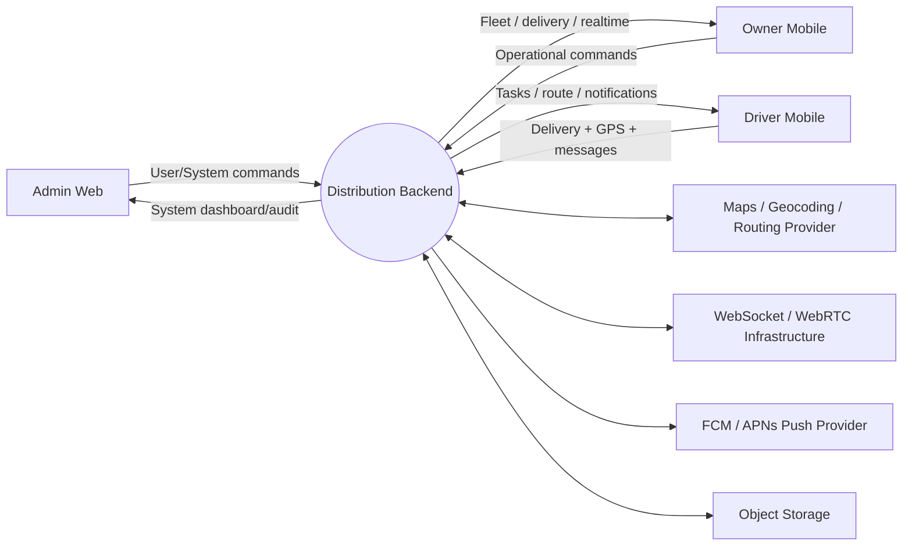

## 2. Level 1 — Core Processes

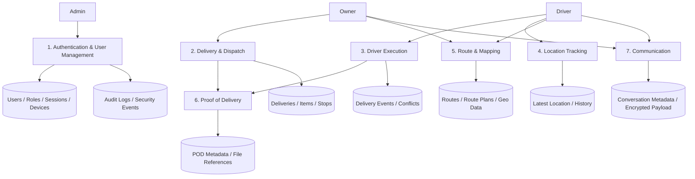

## 3. Level 2 — GPS Flow

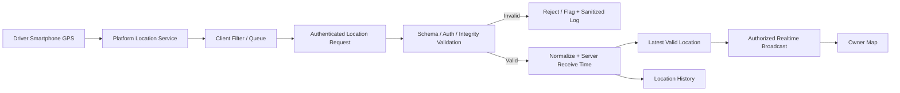

## 4. Level 2 — Delivery Creation and Route

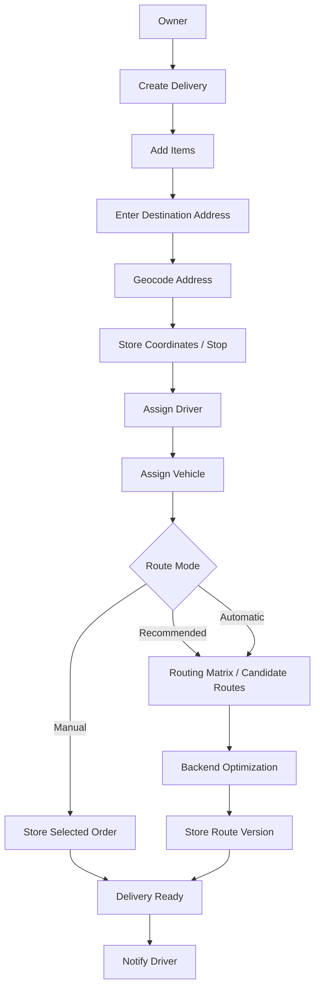

## 5. Communication Flow

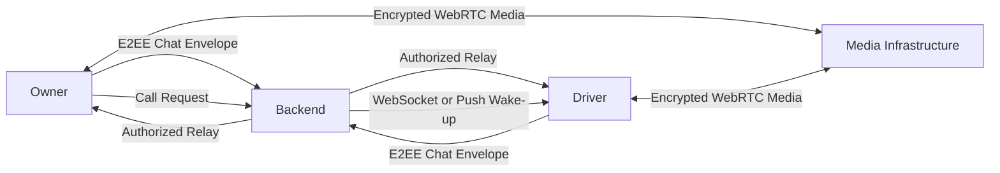

Backend may store encrypted message envelopes and minimal session metadata, but must not log plaintext private communication.

## 6. Delivery State Machine

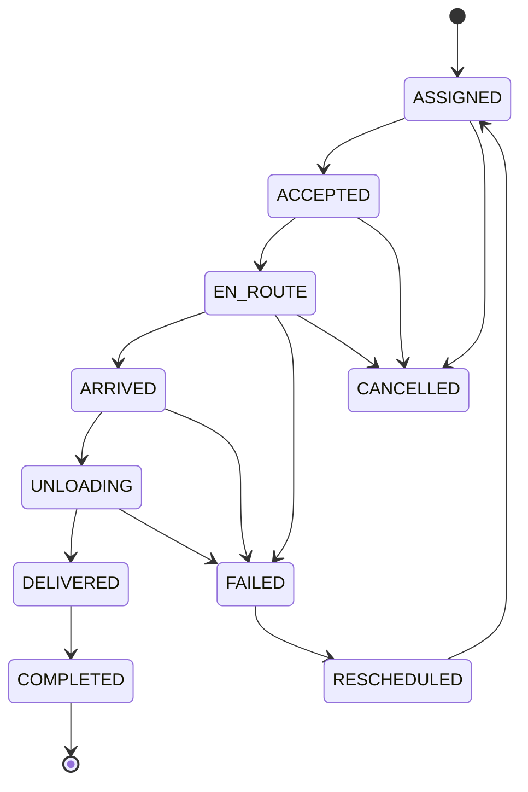

`CANCELLED` is only accepted when the current state and actor permission allow cancellation. A stale offline command cannot silently overwrite a newer state.

## 7. Route State

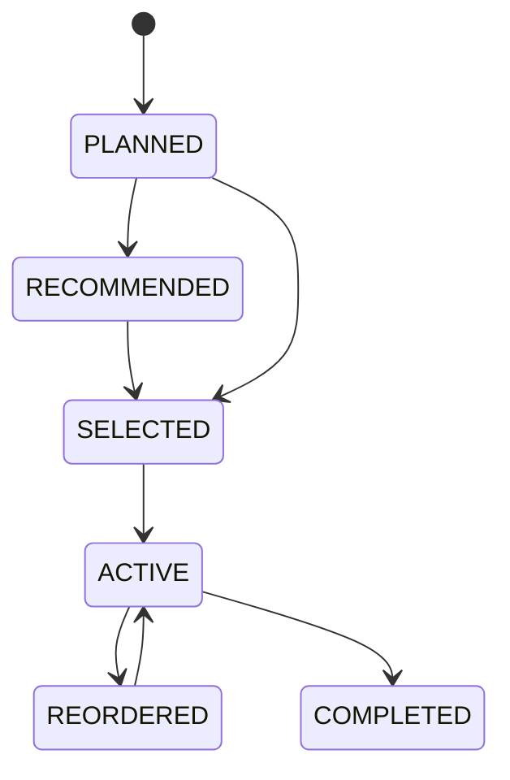

## 8. Data Ownership

| Data | Owner | Driver | Admin |
|---|---|---|---|
| User master | Operational subset | Read self | Full / controlled override |
| Delivery | Create/manage | Execute own | Full / controlled override |
| Driver location | Read authorized | Write self | Full / controlled override |
| Route | Manage | Select/execute | Full |
| POD | Read | Create | Full |
| Chat | Participate | Participate | Controlled metadata/support |
| Audit log | Limited | No | Full |
| Secrets/keys | No direct access | No direct access | Controlled service/infrastructure only |

## 9. Security-Aware Data Flows

### Authentication and Session

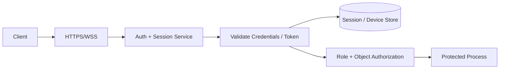

### Private Chat

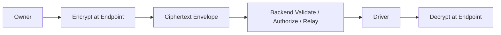

### Secure Upload

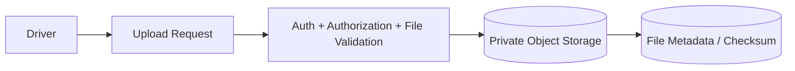

## 10. Network and Media Boundary

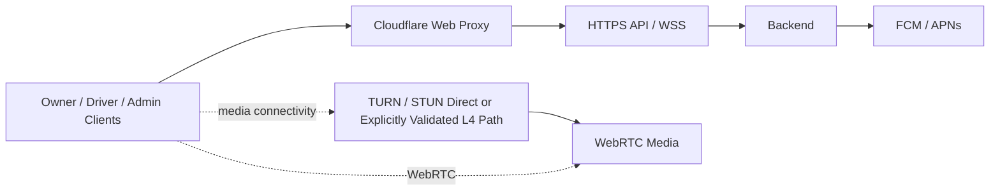

REST and WebSocket traffic may use the ordinary Cloudflare application path. TURN/STUN is a separate transport concern and must not be assumed to work through ordinary HTTP proxying.

## 11. Geocoding Data Flow

```text
Owner enters address
       ↓
Backend validates and normalizes text
       ↓
Geocoding provider
       ↓
Candidate coordinates + confidence/context
       ↓
Owner confirmation where ambiguous
       ↓
Destination / Stop stored with geometry
       ↓
Routing engine
       ↓
Route result
```

Geocoding and routing are separate services. Public geocoding endpoints must be used only within their published usage policy, with caching and rate limiting.

## 12. Offline Conflict Data Flow

```text
Driver command created offline
       ↓
Outbox + idempotency key + client event time
       ↓
Reconnect
       ↓
Backend loads current state
       ↓
Version / state transition check
   ┌──────┴──────┐
 Valid            Conflict
   ↓                 ↓
Apply            Preserve event/POD
   ↓                 ↓
Success       Exception review
                    ↓
             Owner / Admin decision
```

Baseline policy: server-authoritative transactional state plus evidence-preserving exception handling. A conflicting Driver POD/event is not deleted merely because a newer server state exists.

## 13. Mobile Wake-Up and Notification Flow

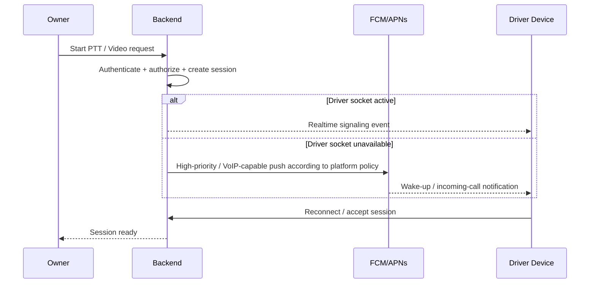

Push is a wake-up/notification mechanism, not a guarantee that arbitrary app code can execute indefinitely. Platform-specific restrictions and terminated/force-stopped cases must be tested.

## 14. Routing Complexity Boundary

```text
Stops
  ↓
Routing engine / matrix
  ↓
Candidate travel costs
  ↓
Backend optimizer
```

For `n <= 5` stops, exhaustive permutation can be used as a simple baseline. For `n > 5`, do not enumerate all permutations in the main request path. Use a heuristic such as Nearest Neighbor + 2-Opt, delegate to a routing engine's trip/optimization capability where suitable, or process optimization asynchronously.

## 15. PostGIS Spatial Flow

```mermaid
flowchart LR
  P[Validated coordinate] --> G[geometry(Point, 4326)]
  G --> IDX[GiST Spatial Index]
  G --> Z[Geofence / distance / bounding queries]
  Z --> R[Operational decision]
```

The canonical geospatial field should be a PostGIS geometry point; latitude/longitude may be retained as API/domain convenience fields but the database spatial column is used for spatial queries.
