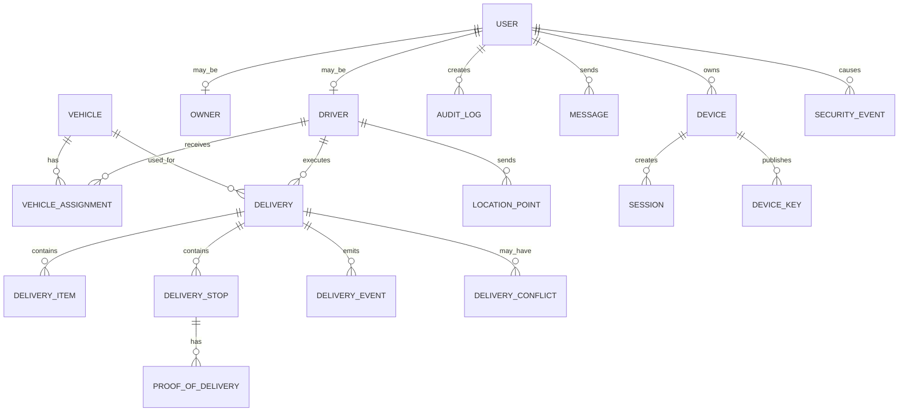
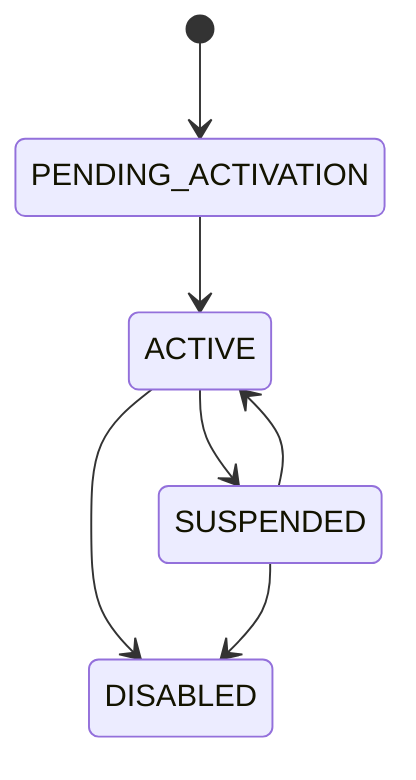

# Domain & Data Model

## 1. Core Entities



## 2. Suggested Tables

### `users`

- id
- username/email/phone
- password_hash
- role_id
- status
- created_by
- created_at
- updated_at
- last_login_at

### `roles`

- id
- code
- name

### `permissions`

- id
- code
- description

### `role_permissions`

- role_id
- permission_id

### `drivers`

- id
- user_id
- employee_code
- display_name
- phone
- active_vehicle_id (optional)
- operational_status

### `vehicles`

- id
- plate_number
- vehicle_type
- capacity_weight
- capacity_volume (optional)
- status
- notes

### `vehicle_assignments`

- id
- driver_id
- vehicle_id
- started_at
- ended_at (nullable)
- status

### `deliveries`

- id
- delivery_code
- driver_id
- vehicle_id
- status
- route_mode
- planned_start_at
- started_at
- completed_at
- created_by
- created_at
- updated_at

### `delivery_items`

- id
- delivery_id
- item_code
- item_name
- quantity
- unit
- weight_kg (optional)
- volume (optional)

### `delivery_stops`

- id
- delivery_id
- sequence
- destination_name
- address
- latitude
- longitude
- geom geometry(Point, 4326)
- geofence_radius_m
- status
- arrived_at
- departed_at
- completed_at

### `routes`

- id
- delivery_id
- version
- source: manual/recommended/automatic
- total_distance_m
- estimated_duration_s
- selected_at
- provider_code (nullable)

### `route_stops`

- route_id
- delivery_stop_id
- sequence

### `location_points`

- id
- driver_id
- delivery_id (nullable)
- latitude
- longitude
- geom geometry(Point, 4326)
- accuracy_m
- speed_mps (nullable)
- heading_deg (nullable)
- recorded_at
- received_at
- source
- validation_status

### `delivery_events`

- id
- delivery_id
- stop_id (nullable)
- event_type
- actor_user_id
- metadata_json
- client_occurred_at (nullable)
- occurred_at
- received_at
- idempotency_key

### `proof_of_delivery`

- id
- delivery_stop_id
- receiver_name
- signature_file_id (nullable)
- photo/file references
- note
- completed_at
- created_by
- version

### `files`

- id
- object_key
- media_type
- size
- checksum
- uploaded_by
- created_at

### `messages`

- id
- conversation_id
- sender_user_id
- message_type
- ciphertext/envelope reference
- created_at
- delivered_at
- read_at

Plaintext E2EE message content must not be required by the backend for normal relay/storage.

### `conversations`

- id
- type
- owner_id
- driver_id
- status

### `realtime_sessions`

- id
- type: voice/video
- owner_id
- driver_id
- delivery_id (nullable)
- status
- created_at
- expires_at
- started_at
- ended_at

### `notifications`

- id
- user_id
- device_id (nullable)
- type
- title
- body
- payload_json
- provider
- provider_message_id (nullable)
- status
- read_at
- created_at

### `audit_logs`

- id
- actor_user_id
- action
- entity_type
- entity_id
- before_json (optional)
- after_json (optional)
- result
- request_id
- ip/device metadata where policy allows
- created_at

## 3. Spatial Representation & Indexing

PostGIS is the canonical spatial representation for geospatial queries.

```sql
geom geometry(Point, 4326)
```

Required/recommended GiST indexes for high-volume spatial tables:

```sql
CREATE INDEX idx_location_points_geom
ON location_points
USING GIST (geom);

CREATE INDEX idx_delivery_stops_geom
ON delivery_stops
USING GIST (geom);
```

Latitude/longitude remain useful API/domain fields, but spatial operations such as geofence, bounding box, nearest-point, and indexed distance searches should use the PostGIS geometry column.

Coordinate reference semantics use WGS 84 / EPSG:4326 for stored GPS points.

## 4. User & Device Lifecycle



Device/session lifecycle is separate from account lifecycle:

```text
REGISTERED → ACTIVE → REVOKED
```

A revoked device/session cannot create new protected API or realtime activity.

## 5. Driver Operational Status

```text
OFFLINE
  |-> ONLINE
ONLINE
  |-> AVAILABLE
AVAILABLE
  |-> ASSIGNED
ASSIGNED
  |-> DRIVING
DRIVING
  |-> ARRIVED
ARRIVED
  |-> DELIVERING
DELIVERING
  |-> AVAILABLE / DRIVING / OFFLINE
```

## 6. Important Domain Rules

- A Driver cannot execute a delivery unless the delivery is assigned and active.
- A Driver can submit location only for self and only when authorized by delivery/tracking state.
- Owner can view only operational data within permitted company/tenant scope.
- Admin can access all configured scopes according to policy.
- Delivery state transitions are validated server-side.
- POD evidence is preserved and versioned; ordinary users cannot silently rewrite accepted evidence.
- Route recommendation does not automatically become binding unless the route mode requires it.
- A stale offline command cannot silently overwrite a newer server state.
- Client timestamps are advisory; server receive time is authoritative for server ordering where needed.

## 7. Security & Session Entities

### `devices`

- id
- user_id
- platform
- app_version
- device_status
- push_token_reference (nullable)
- first_seen_at
- last_seen_at
- revoked_at

### `sessions`

- id
- user_id
- device_id
- refresh_token_family_id / opaque session identifier
- created_at
- last_seen_at
- expires_at
- revoked_at
- revoke_reason
- replaced_by_id (nullable)

Store only a secure token hash/reference, not a reusable plaintext refresh token.

### `device_keys`

- id
- device_id
- key_type
- public_key
- fingerprint
- version
- status
- created_at
- revoked_at

Private keys remain on the endpoint secure storage when required by the selected E2EE protocol.

### `idempotency_records`

- id
- actor_user_id
- idempotency_key
- operation
- request_fingerprint
- result_reference
- created_at
- expires_at

### `security_events`

- id
- actor_user_id (nullable)
- device_id (nullable)
- event_type
- severity
- outcome
- request_id
- metadata_json (sanitized)
- occurred_at

Never store plaintext private communication in security events.

## 8. Offline Conflict Model

### `delivery_conflicts`

- id
- delivery_id
- command_event_id
- client_event_id
- idempotency_key
- current_server_state
- requested_state
- reason_code
- submitted_evidence_reference (nullable)
- status: OPEN / RESOLVED / REJECTED
- resolved_by (nullable)
- resolved_at (nullable)
- resolution_note (nullable)

Baseline policy:

```text
Server-authoritative state
        +
Evidence-preserving exception workflow
```

Conflicting Driver POD/events remain traceable for Owner/Admin review rather than being silently deleted.

## 9. Routing & Provider Abstraction

Domain data stores provider-independent route concepts:

```text
Delivery
  └── Route
       ├── source/mode
       ├── selected sequence
       ├── distance
       ├── duration
       └── route version
```

Provider-specific payloads remain in the integration layer or normalized cache.

For routing complexity:

```text
n <= 5
→ exhaustive baseline permitted

n > 5
→ heuristic / engine-assisted optimization
```

## 10. File Storage & Sensitive Media

```text
Application DB
    └── object key / checksum / metadata
                ↓
          Private Object Storage
```

Files are private by default. Access must be authorized before download. Large media objects are not stored in the application container filesystem.

Realtime voice/video media is not persisted by the business database unless a separately approved recording feature exists.

## 11. Notification / Wake-Up Model

The backend stores the pending notification/session state independently of the mobile WebSocket connection.

```text
realtime session request
        ↓
create pending state
        ↓
WebSocket if online
        OR
FCM/APNs wake-up notification
        ↓
client reconnect / accept
        ↓
backend verifies current state
```

## 12. Privacy & Access Rules

- Driver location is visible only to authorized Owner/Admin users.
- Driver may submit location only for self.
- Conversation membership determines message access.
- Voice/video session membership determines signaling authorization.
- Device/session revocation invalidates future protected operations.
- POD files require resource-level authorization.
- Location history follows retention policy.
- Sensitive notification payloads are minimized.

## 13. Database Integrity Rules

- Primary/foreign keys enforce relational integrity.
- State transitions are validated in transactions.
- Critical commands are idempotent.
- Spatial columns and GiST indexes are managed through versioned migrations.
- Destructive migrations require backup and rollback/recovery planning.
