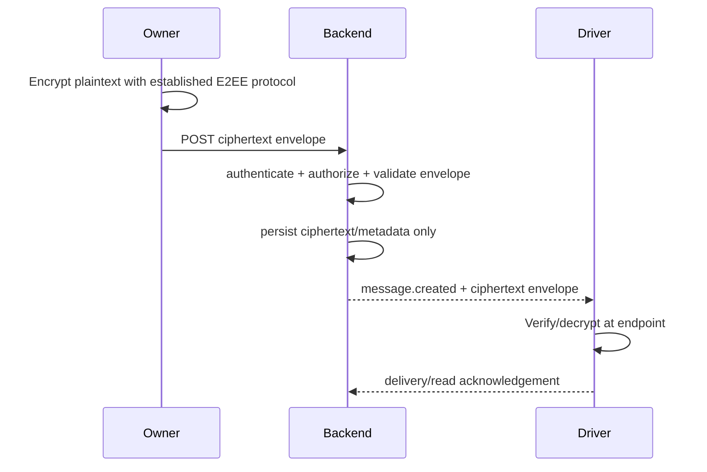

# API, Realtime, GPS & Integration Contract

**Version:** 1.1
**Status:** Baseline contract; provider/ORM choices remain replaceable.

## 1. API conventions

- REST/JSON for transactional APIs.
- HTTPS for REST; WSS for WebSocket.
- WebSocket for business realtime events.
- WebRTC for voice/video media.
- ISO-8601 UTC timestamps at the API boundary.
- Pagination for collections.
- Consistent error format.
- Strict request/response schema validation.
- Idempotency keys for retryable commands.
- API requests require authentication unless explicitly public.
- Resource access requires server-side RBAC/object-level authorization.
- Rate limiting applies to authentication and other sensitive/high-cost endpoints.
- CORS uses an explicit allowlist.
- No secrets or private E2EE content in logs.

## 2. Example REST endpoints

### Authentication

```text
POST /v1/auth/login
POST /v1/auth/refresh
POST /v1/auth/logout
POST /v1/auth/activate
```

### User management

```text
GET    /v1/users
POST   /v1/users
GET    /v1/users/:id
PATCH  /v1/users/:id
POST   /v1/users/:id/disable
POST   /v1/users/:id/reactivate
```

### Drivers

```text
GET /v1/drivers
GET /v1/drivers/:id
POST /v1/drivers
PATCH /v1/drivers/:id
```

### Vehicles

```text
GET /v1/vehicles
POST /v1/vehicles
PATCH /v1/vehicles/:id
```

### Deliveries

```text
GET    /v1/deliveries
POST   /v1/deliveries
GET    /v1/deliveries/:id
PATCH  /v1/deliveries/:id
POST   /v1/deliveries/:id/assign
POST   /v1/deliveries/:id/route/recommend
POST   /v1/deliveries/:id/route/select
POST   /v1/deliveries/:id/start
POST   /v1/deliveries/:id/complete
POST   /v1/deliveries/:id/fail
```

### Driver execution

```text
GET  /v1/me/deliveries
GET  /v1/me/deliveries/:id
POST /v1/me/deliveries/:id/accept
POST /v1/me/stops/:id/arrive
POST /v1/me/stops/:id/complete
POST /v1/me/stops/:id/pod
POST /v1/me/location
```

### Communication

```text
GET  /v1/conversations
GET  /v1/conversations/:id/messages
POST /v1/conversations/:id/messages
POST /v1/voice-sessions
POST /v1/video-sessions
POST /v1/realtime/sessions/:id/end
POST /v1/realtime/sessions/:id/ice-candidate
```

Private chat message bodies are sent as encrypted protocol payloads/envelopes. The API transports ciphertext and message metadata required for delivery; it does not require plaintext storage.

## 3. Example GPS payload

```json
{
  "idempotencyKey": "loc-01J...",
  "latitude": -6.20012,
  "longitude": 106.81620,
  "accuracyM": 8.4,
  "speedMps": 11.7,
  "headingDeg": 87.0,
  "recordedAt": "2026-08-26T07:32:21Z"
}
```

## 4. GPS ingestion rules

The backend should:

1. authenticate driver/device;
2. validate coordinates;
3. reject impossible timestamps/outliers;
4. compare accuracy threshold;
5. attach server receive time;
6. update latest location;
7. persist history according to retention policy;
8. broadcast a sanitized event to authorized Owner clients.

## 5. Realtime event examples

All server-emitted events follow the **Canonical Realtime Event Envelope** (Phase 3 & Phase 4 Standard):

```json
{
  "eventId": "f47ac10b-58cc-4372-a567-0e02b2c3d479",
  "event": "driver.location.updated",
  "version": 1,
  "timestamp": "2026-09-02T10:20:00.045Z",
  "correlationId": "c8f5f0b4-3a7e-46d2-850f-2b1b51e0cf9b",
  "actor": {
    "userId": "b8a34f89-8d7e-4a61-9c60-84a92c304d91",
    "role": "DRIVER",
    "deviceId": "550e8400-e29b-41d4-a716-446655440000",
    "driverId": "drv_123"
  },
  "payload": {
    "driverId": "drv_123",
    "deliveryId": "del_456",
    "latitude": -6.20012,
    "longitude": 106.81620,
    "accuracyM": 8.4,
    "speedMps": 11.7,
    "headingDeg": 87.0,
    "recordedAt": "2026-09-02T10:20:00.000Z",
    "receivedAt": "2026-09-02T10:20:00.045Z"
  }
}
```

Other event types:

```text
fleet.driver.status_changed
delivery.assigned
delivery.status_changed
delivery.route.updated
delivery.stop.arrived
delivery.stop.completed
chat.message.send
chat.message.relayed
chat.message.ack
webrtc.call.invite
webrtc.call.respond
webrtc.signal.offer
webrtc.signal.answer
webrtc.signal.ice_candidate
webrtc.call.ended
notification.created
emergency.created
```

## 6. Chat flow



The backend may know conversation membership, sender, timestamps, message identifiers, delivery status, and other necessary metadata. It must not log plaintext message content.

## 7. Push-to-talk flow

```mermaid
sequenceDiagram
  participant O as Owner
  participant B as Backend
  participant D as Driver
  participant M as Media Infra

  O->>B: create authorized voice session
  B->>B: authenticate + authorize
  B->>M: provision session / ICE-TURN credentials
  B-->>D: incoming voice request
  D->>B: accept
  B-->>O: signaling/session information
  B-->>D: signaling/session information
  O<->>M: WebRTC encrypted media
  D<->>M: WebRTC encrypted media
```

Backend handles signaling and authorization. Audio is not sent through ordinary REST endpoints.

## 8. Video flow

```mermaid
sequenceDiagram
  participant O as Owner
  participant B as Backend
  participant D as Driver
  participant M as Media Infra

  O->>B: request video
  B->>B: authorize Owner -> Driver relationship
  B-->>D: video request
  D->>B: accept/decline
  B->>M: signaling/session coordination
  O<->>M: WebRTC encrypted media
  D<->>M: WebRTC encrypted media
```

The Driver must explicitly accept the video request. Camera/microphone permissions are controlled by the operating system and application.

## 9. Maps integration

Use provider adapter such as:

```text
MapsProvider
├── geocode()
├── route()
├── routeMatrix()
└── optimizeWaypoints()
```

Do not call external routing services per GPS ping. Route/ETA refresh should use defined triggers such as new delivery plan, significant route deviation, manual refresh, or bounded periodic recomputation.

## 10. Error contract

```json
{
  "error": {
    "code": "DELIVERY_NOT_ASSIGNABLE",
    "message": "Driver is not available for this delivery.",
    "requestId": "req_123"
  }
}
```

Never expose database errors, stack traces, or secrets to clients.


## 11. Security transport and media rules

- REST: HTTPS only in production.
- WebSocket: WSS only in production.
- JWT/session authentication is applied before protected realtime subscriptions.
- WebRTC signaling is authenticated and authorized.
- WebRTC media uses standard WebRTC encryption (DTLS-SRTP).
- If an SFU is used and the threat model requires the SFU not to access plaintext media, evaluate an end-to-end media layer such as SFrame.
- TURN credentials must be short-lived or otherwise tightly scoped.
- Backend logs contain session IDs/status, not plaintext audio/video.
- Same-network capture must reveal no application plaintext chat or unencrypted WebRTC RTP media.

## 12. Routing provider abstraction

```text
RoutingService
├── calculateRoute()
├── calculateMatrix()
├── optimizeCandidates()
└── healthCheck()
```

The backend owns business optimization. Provider-specific SDK/API details stay behind the integration boundary.

## 13. Offline/retry

Critical mobile commands should carry idempotency keys. Location updates can use bounded buffering. Delivery/POD state must remain transactionally consistent after reconnect.

## 14. Example encrypted chat envelope

The exact wire format depends on the selected established E2EE protocol and must not be invented before protocol selection.

Conceptually:

```json
{
  "messageId": "msg_123",
  "conversationId": "conv_1",
  "protocol": "E2EE_PROTOCOL_VERSION",
  "ciphertext": "<base64-or-binary>",
  "header": "<protocol-defined-header>",
  "createdAt": "2026-08-30T10:00:00Z"
}
```

No `plaintextBody` field is required by the server.

## 15. Security contract extensions

### Authentication/session headers

Protected HTTP/WebSocket operations require valid authentication. Access tokens are short-lived; refresh/session mechanisms are revocable.

### Error contract

Errors must use stable machine-readable codes and safe human messages. Internal stack traces, SQL fragments, tokens, secrets, and cryptographic material must never be returned to clients.

### Idempotency

Critical mutation endpoints should accept an idempotency key. Server behavior must return the original logical result for a duplicate request instead of executing the business action again.

### WebSocket rules

- Authenticate during connection establishment and/or session authorization.
- Authorize channel/room subscription.
- Validate every sensitive event payload.
- Enforce event size/rate limits.
- Revoke sessions so future events are rejected after account/device disablement.

### WebRTC signaling

Signaling payloads contain session metadata/ICE information only and are validated, scoped, size-limited, authenticated, and short-lived. The signaling service is not a substitute for media encryption.

### Secure upload API

Upload endpoints must apply authentication, authorization, content limits, safe object-key generation, metadata validation, and download authorization.

## 16. GPS anti-abuse rules

The backend should compare timestamps, coordinates, speed, accuracy, and prior accepted points. Suspicious points may be rejected or flagged rather than becoming the latest authoritative location.

## 17. Provider abstraction

Mapping and routing are integration concerns. The domain API should expose operations such as:

```text
calculateRoute(origin, destinations, options)
calculateMatrix(points, options)
recommendStopOrder(stops, constraints)
```

The concrete provider can be OSM/OSRM, openrouteservice, Google, or another evaluated provider.


## 10. Secure realtime and session conventions

All protected WebSocket connections authenticate with a valid session/token and are authorized for each subscription/room. Event handlers must validate payload schemas and enforce object-level authorization.

Recommended protected event envelope:

```json
{
  "eventId": "evt_123",
  "type": "delivery.status.update",
  "timestamp": "2026-08-30T12:00:00Z",
  "payload": {},
  "idempotencyKey": "idem_123"
}
```

Server-side processing should validate timestamp freshness, authorization, idempotency, replay constraints, and business-state transition before applying the event.

## 11. Geocoding API boundary

The backend should expose a provider-agnostic interface:

```text
GeocodingService
- geocode(address)
- reverseGeocode(latitude, longitude)
```

Public geocoding services must not be used for unbounded autocomplete or bulk workloads outside provider policy. The provider may be replaced by self-hosted or another compatible service.

## 12. Offline command conflict response

When a queued command becomes invalid, the API should return a machine-readable conflict response rather than a generic 500:

```json
{
  "code": "STATE_CONFLICT",
  "currentState": "CANCELLED",
  "requestedAction": "COMPLETE",
  "requiresReview": true
}
```

## 13. WebRTC signaling security

Signaling endpoints/events shall:

- require authenticated sessions;
- verify Owner↔Driver relationship/scope;
- issue short-lived session credentials;
- reject stale/replayed offers/answers/candidates according to session state;
- record sanitized session lifecycle metadata for audit;
- never place media payloads into ordinary REST endpoints.

## 14. Upload API security

Upload APIs must enforce:

```text
Authentication
→ Authorization
→ size/type limits
→ safe naming/object key
→ content validation
→ private storage
→ temporary authorized access
```

Never trust client-provided MIME type alone.


## 10. Mobile Wake-Up / Push Contract

WebSocket is the primary connected-session channel. Push is the fallback notification/wake-up mechanism; it is not the authoritative source of pending call state.

### Push registration

```text
POST /v1/devices/register-push-token
POST /v1/devices/:id/revoke
```

Store provider token references with device/session ownership and rotate/revoke them when appropriate.

### Call request

```text
POST /v1/voice-sessions
POST /v1/video-sessions
```

Flow:

```text
Backend authorizes owner→driver session
       ↓
Persist pending session
       ↓
Driver socket available?
  ┌──────┴──────┐
 YES            NO
  ↓              ↓
WSS event    FCM / APNs notification
  ↓              ↓
Driver reconnects / accepts
       ↓
Backend revalidates session
       ↓
WebRTC signaling
```

Push payloads must contain minimal sensitive information and must not be treated as proof that the user has accepted the session.

## 11. Geocoding / Routing API Boundary

```text
POST /v1/geocoding/search
POST /v1/geocoding/reverse
POST /v1/routes/matrix
POST /v1/routes/recommend
```

The backend owns provider abstraction, caching, input validation, and rate limiting. Client applications must not depend directly on provider-specific routing response schemas.

## 12. Routing Complexity Guard

`/v1/routes/recommend` must enforce a stop-count guard:

```text
<= 5 stops
→ exhaustive baseline allowed

> 5 stops
→ heuristic/engine-assisted path
```

No request may execute uncontrolled factorial enumeration on the main event loop. Large optimization jobs should be offloaded to an asynchronous worker when necessary.

## 13. PostGIS Spatial API Rules

Location and destination APIs accept validated latitude/longitude values. The service converts them to PostGIS geometry points and uses spatial indexes for spatial queries.

The API must preserve both client-recorded time and server-received time for location events where audit/ordering is relevant.
