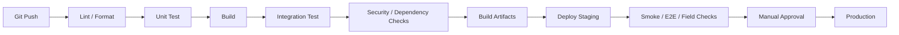

# Testing, Deployment, Observability, Infrastructure & Roadmap

## 1. Testing Strategy

### Unit Tests

Target:

- delivery state machine;
- permission evaluation;
- object authorization;
- route mode and optimization boundary;
- geofence logic;
- location validation/outlier detection;
- idempotency/replay handling;
- conflict resolution;
- notification policy.

### Integration Tests

Target:

- authentication + database;
- refresh/session revocation;
- delivery lifecycle;
- assignment;
- location ingestion;
- WebSocket authorization/event delivery;
- FCM/APNs integration contract;
- geocoding/routing provider integration;
- POD storage;
- object-storage authorization.

### E2E Tests

Primary journey:

```text
Admin creates Driver
  ↓
Driver activation
  ↓
Owner creates Delivery
  ↓
Owner assigns Driver
  ↓
Driver accepts
  ↓
Driver sends GPS
  ↓
Owner sees location
  ↓
Driver reaches stop
  ↓
POD submitted
  ↓
Delivery completed
```

### Mobile Field Tests

Must test:

- GPS permission denied;
- GPS disabled;
- weak GPS accuracy;
- background mode;
- Android foreground service behavior;
- iOS background location behavior;
- phone locked;
- app backgrounded/suspended;
- app restart;
- low battery;
- cellular/Wi-Fi loss;
- reconnect;
- duplicate event submission;
- offline command conflict;
- poor network during POD upload;
- driver force-stops/swipes away app;
- Owner call request while Driver socket is offline;
- wake-up push delivery where platform permits.

## 2. Performance Tests

Benchmark separately:

- REST request latency;
- location ingestion throughput;
- WebSocket fan-out;
- concurrent active drivers;
- concurrent map viewers;
- media session concurrency;
- object upload/download;
- geocoding request rate/cache hit ratio;
- route matrix latency;
- route optimization CPU time by stop count;
- VPS memory/CPU/disk/network usage.

Routing test must explicitly compare `n <= 5` exhaustive mode against heuristic/engine-assisted mode for `n > 5` and verify no factorial explosion occurs in the request path.

## 3. Security & Resilience Tests

### Network / Cloudflare / WebRTC

- verify REST and WSS through intended Cloudflare path;
- verify TURN/STUN path independently;
- confirm TURN does not depend on ordinary HTTP proxying;
- same-Wi-Fi packet inspection;
- TLS certificate/origin validation;
- signaling authentication and authorization.

### Authentication / Authorization

- JWT signature/key validation;
- expired/revoked token;
- refresh-token rotation and reuse detection;
- device/session revocation;
- IDOR/BOLA;
- role escalation;
- disabled account realtime disconnect;
- rate limiting;
- CORS allowlist;
- schema validation.

### Communication Privacy

- verify ciphertext handling for E2EE chat;
- verify backend logs never contain plaintext chat/media;
- verify WebRTC media uses authenticated/encrypted transport;
- test E2EE fallback classification so non-E2EE mode is never advertised as E2EE.

### Upload / Logging

- malicious file type/size/path;
- authorization on object retrieval;
- checksum/integrity;
- log injection;
- secret leakage;
- token/password/key redaction.

## 4. Offline Conflict and Time Tests

Scenarios:

```text
Driver offline → Delivered
Owner online   → Cancelled
Driver reconnects
```

Expected:

```text
server state remains authoritative;
conflicting event is preserved;
POD/evidence is retained;
exception is auditable;
Owner/Admin can resolve according to policy.
```

Also test:

- stale client timestamp;
- future timestamp;
- duplicated event;
- out-of-order event;
- large client clock skew.

## 5. Observability

Logs:

- structured logs with request/correlation ID;
- authentication/security events;
- delivery state changes;
- integration failures;
- realtime session state;
- routing/geocoding failures;
- push delivery outcomes.

Never log:

- passwords;
- JWT/access/refresh tokens;
- signing keys;
- encryption keys;
- plaintext E2EE messages;
- raw media;
- private TURN credentials.

Metrics:

- API latency/error rate;
- active driver count;
- location freshness;
- invalid GPS event count;
- realtime connections;
- message delivery rate;
- push wake-up success/failure;
- route provider latency/error;
- geocoder cache hit/miss;
- POD upload failures;
- CPU/RAM/disk/network usage.

## 6. CI/CD



## 7. Environments and Infrastructure Profiles

- `local` — developer workstation.
- `development` — optional shared environment.
- `staging` — Capstone integration/demo.
- `production` — hardened deployment when required.

### Cost-aware staging baseline

```text
2 vCPU
2 GB RAM
30 GB SSD/NVMe
Linux LTS
Docker
```

For the staging baseline, keep heavy routing/media infrastructure external or separately hosted unless resource tests prove co-location safe.

### More comfortable baseline

```text
2–4 vCPU
4 GB RAM
40–60 GB SSD/NVMe
```

Self-hosted OSRM or TURN must not be assumed to fit safely on the 2 GB profile.

## 8. Database Migration, Backup & Recovery

- all schema changes versioned;
- migration scripts reviewed;
- backups before destructive migrations;
- restore strategy documented;
- restore drill before production launch;
- PostGIS indexes and spatial schema covered by migration tests;
- backup contents treated as sensitive assets.

## 9. Recommended Roadmap

### Phase 0 — Foundation

- repository structure;
- backend bootstrap;
- PostgreSQL/PostGIS;
- auth/RBAC/session/device model;
- Admin Web shell;
- Owner/Driver mobile shells;
- environment configuration.

### Phase 1 — Core Distribution

- user management;
- driver/vehicle;
- delivery/item/destination;
- geocoding;
- assignment;
- state machine;
- audit.

### Phase 2 — Maps & Tracking

- platform background location;
- GPS ingestion/validation;
- location history;
- Owner live map;
- route/manual ordering;
- navigation handoff.

### Phase 3 — Reliability & Optimization

- offline outbox;
- conflict resolution;
- POD;
- route recommendation;
- `n <= 5` exhaustive baseline;
- `n > 5` heuristic/engine-based optimization;
- geofence;
- notifications;
- reports.

### Phase 4 — Realtime Communication

- chat;
- push wake-up;
- WebRTC signaling;
- push-to-talk;
- Owner-requested video;
- media authorization/audit;
- E2EE hardening.

### Phase 5 — Production Hardening

- load tests;
- mobile field tests;
- security assessment;
- observability;
- backup/restore drills;
- dependency review;
- release process.

## 10. Suggested Git Checkpoints

```text
chore: initialize project workspace
feat(auth): add authentication and role model
feat(session): add device and session management
feat(admin): add user management
feat(delivery): add delivery and item management
feat(mapping): add geocoding abstraction
feat(tracking): add phone GPS ingestion
feat(owner): add live fleet map
feat(route): add route selection and optimization boundary
feat(pod): add proof of delivery
feat(sync): add offline outbox and conflict handling
feat(push): add call wake-up notifications
feat(chat): add owner-driver messaging
feat(realtime): add push-to-talk
feat(video): add owner-requested video
chore: production hardening
```

## 11. Security / Communication Test Gates

A release candidate must not be promoted until:

1. authentication and object authorization tests pass;
2. revoked sessions cannot access protected channels;
3. API/WSS security baseline is active;
4. same-Wi-Fi sniffing cannot recover protected transport data;
5. private communication logging is sanitized;
6. WebRTC signaling is authorization-protected;
7. push wake-up behavior is validated on supported target devices;
8. GPS and offline conflict tests pass.

## 12. Routing and Resource Gates

Before selecting self-hosted routing/media:

- benchmark real map extracts;
- measure peak RAM during route preprocessing/runtime;
- measure CPU for route optimization;
- measure TURN connection/load behavior;
- verify no resource starvation on database/API;
- record decision in the technology decision log.

## 13. Definition of Done

A feature is done when:

- requirements are mapped;
- backend authorization exists;
- API/event contract is documented;
- automated tests cover critical behavior;
- UI handles loading/error/empty/offline states where relevant;
- audit/telemetry exists where needed;
- migration is included when schema changes;
- security implications are reviewed;
- manual acceptance scenario passes;
- Git checkpoint is created.

## 14. Implementation Gate

The project may proceed from documentation to sprint execution only after:

```text
Architecture baseline
       ↓
Technology decision log
       ↓
Database schema + migrations
       ↓
Repository setup
       ↓
Environment/bootstrap
       ↓
First vertical slice
```

No technology decision marked `TBD` should silently become an undocumented production dependency.
