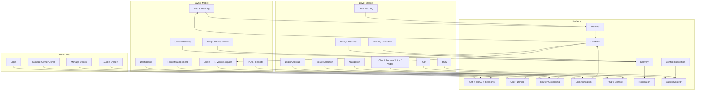
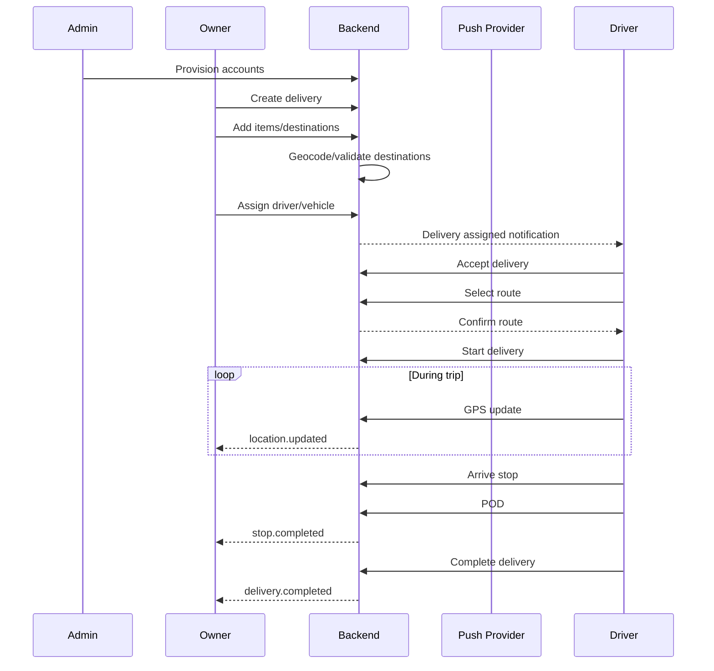
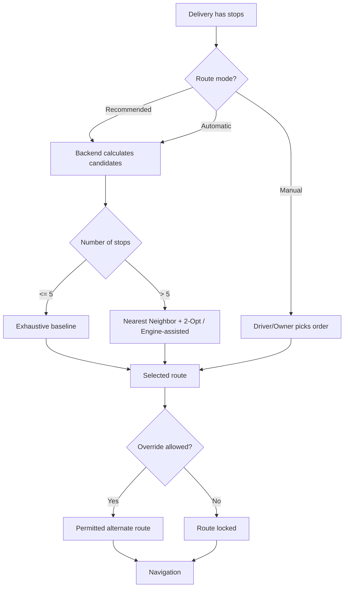
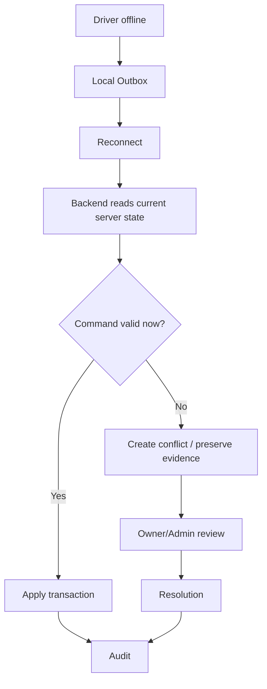
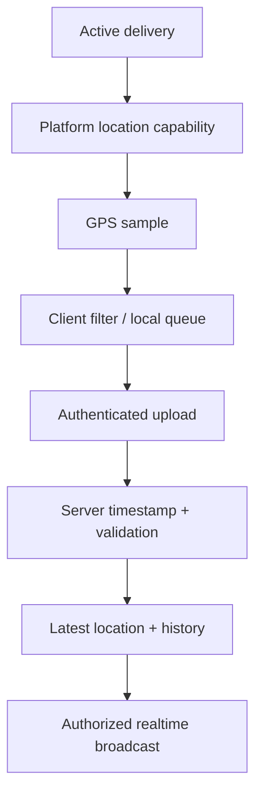
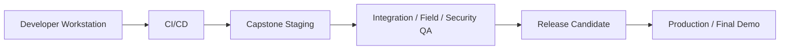

# Project Flow & Implementation Illustration

## 1. End-to-End System Flow



## 2. Daily Operating Flow



## 3. Route Decision Flow



## 4. Communication Flow

```mermaid
sequenceDiagram
  participant O as Owner
  participant B as Backend
  participant P as FCM/APNs
  participant D as Driver
  participant M as WebRTC Media

  O->>B: Request PTT/video
  B->>B: Auth + object authorization
  alt Driver socket online
    B-->>D: WebSocket signaling
  else Socket unavailable
    B->>P: Platform push wake-up / VoIP notification
    P-->>D: Incoming request notification
    D->>B: Reconnect / accept
  end
  B-->>O: Session metadata
  B-->>D: Session metadata
  O<->>M: WebRTC encrypted media
  D<->>M: WebRTC encrypted media
```

## 5. Security Gates in Every Sensitive Operation

```text
Client Request
    ↓
TLS / WSS
    ↓
Authentication
    ↓
Schema Validation
    ↓
Rate Limit / Abuse Check
    ↓
Object Authorization
    ↓
Business-State Validation
    ↓
Idempotency / Replay Check
    ↓
Transaction
    ↓
Audit / Security Event
    ↓
Sanitized Realtime Notification
```

## 6. Offline Conflict Flow



## 7. Background GPS Flow



## 8. Mobile Wake-Up Flow

```text
Owner requests PTT/video
        ↓
Backend authorizes session
        ↓
Driver socket online?
   ┌────────┴─────────┐
  YES                 NO
   ↓                   ↓
WebSocket         FCM/APNs wake-up
   ↓                   ↓
Driver receives/reconnects
          ↓
     Session accepted
```

Wake-up pushes are platform mechanisms with restrictions; they are not a replacement for durable server state or a guarantee of arbitrary background execution.

## 9. Geocoding and Mapping Flow

```text
Owner enters address
       ↓
Geocoding abstraction
       ↓
Candidate coordinates
       ↓
Owner confirmation if ambiguous
       ↓
PostGIS geometry point
       ↓
Routing engine
       ↓
Route/matrix result
       ↓
Backend optimization
       ↓
Owner/Driver map
```

## 10. PostGIS Spatial Flow

```text
GPS coordinate
     ↓
geometry(Point, 4326)
     ↓
GiST spatial index
     ↓
geofence / nearest / bounding queries
```

## 11. Recommended Implementation Order

```text
1. Repository + Git checkpoint
2. Database + PostGIS migrations
3. Auth + RBAC + sessions/devices
4. Admin Web user management
5. Owner delivery management
6. Driver delivery execution
7. Vehicle assignment
8. Geocoding abstraction
9. GPS ingestion + validation
10. Owner live map
11. Route/manual navigation
12. Offline outbox + conflict handling
13. POD
14. Notifications + wake-up push
15. Route recommendation / optimization boundary
16. Chat
17. Push-to-talk
18. Video request
19. Security hardening
20. Testing + staging + release
```

## 12. Practical Team Split

### Backend / Security

```text
Auth / Sessions / Devices
Users / Roles
Drivers / Vehicles
Deliveries / Items / Stops
Geocoding / Routing integration
Tracking / Location validation
Messaging / E2EE integration
Realtime / WebSocket
WebRTC signaling
POD / Upload authorization
Notifications / Push wake-up contract
Audit / Security events
Conflict resolution
```

### Owner Mobile / Driver Mobile / Admin Web

See `10-TEAM-RESPONSIBILITY.md` for the detailed ownership matrix.

## 13. Infrastructure & Deployment Flow



Staging should use the cost-aware VPS baseline and isolate heavy routing/media infrastructure unless resource testing proves safe.

## 14. Final Technical Flow

```text
Client
  ↓ HTTPS/WSS
Cloudflare / Reverse Proxy
  ↓
NestJS Auth + Validation + Rate Limit
  ↓
RBAC + Object Authorization
  ↓
Domain Service
  ↓
ORM / Parameterized DB Access
  ↓
PostgreSQL + PostGIS / Redis / Object Storage

Realtime media:
Client ↔ WebRTC ↔ Media Infrastructure
           ↑
    Backend signaling/auth
```
