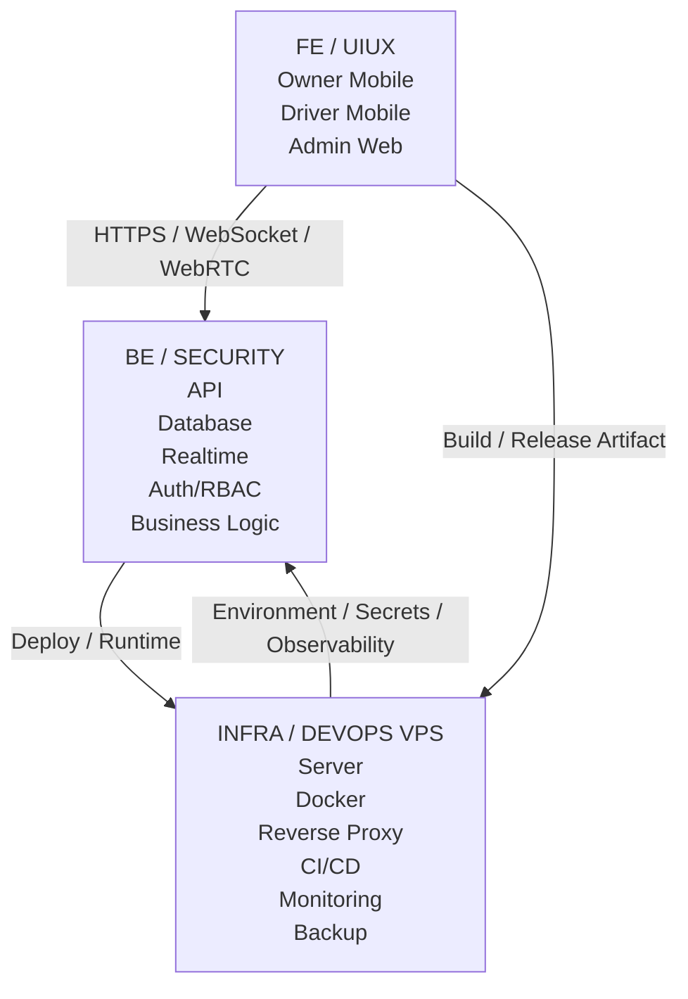
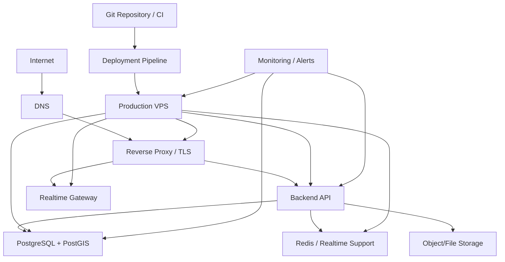
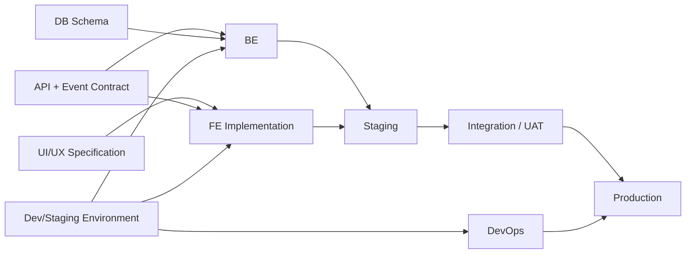

# Team Responsibility & Work Allocation

## 1. Tujuan

Dokumen ini membagi pengerjaan sistem menjadi tiga domain utama:

1. **FE / UI/UX** — aplikasi Owner Mobile, Driver Mobile, dan desain antarmuka.
2. **BE / Security** — backend API, database, business logic, realtime, authentication, authorization, dan security.
3. **Infrastructure / DevOps VPS** — server, deployment, networking, CI/CD, monitoring, backup, secrets, dan operational reliability.

Pembagian ini mengikuti arsitektur proyek yang terdiri dari **Owner Mobile + Driver Mobile + Backend + Infrastruktur VPS**. Admin menggunakan **Web Admin** yang dapat dikerjakan oleh tim FE dan tetap menggunakan backend yang sama.

---

## 2. Pembagian Besar



---

## 3. FE / UIUX

### Tanggung jawab utama

- User flow dan information architecture.
- Design system dan UI kit.
- Owner Mobile App.
- Driver Mobile App.
- Admin Web.
- State/loading/error/empty UI.
- Map interface dan marker driver.
- Delivery workflow.
- Chat UI.
- Push-to-talk UI.
- Video call UI.
- Proof of Delivery UI.
- Notification UI.
- Frontend validation.
- Integration dengan API backend.
- Integration dengan WebSocket/WebRTC client.
- Device permission untuk location, camera, microphone, notification.
- Mobile build, signing, dan release preparation.

### Modul yang dimiliki

```text
FE / UIUX
├── Design System
├── Owner Mobile
│   ├── Login
│   ├── Dashboard
│   ├── Fleet Map
│   ├── Driver Detail
│   ├── Delivery Management
│   ├── Route Management
│   ├── Driver Communication
│   ├── Reports
│   └── Notifications
│
├── Driver Mobile
│   ├── Login / Activation
│   ├── Today's Delivery
│   ├── Route
│   ├── Navigation
│   ├── Delivery Detail
│   ├── Delivery Status
│   ├── Proof of Delivery
│   ├── Chat
│   ├── Voice / Video
│   └── Emergency
│
└── Admin Web
    ├── Dashboard
    ├── User Management
    ├── Driver Management
    ├── Owner Management
    ├── Vehicle Management
    ├── Audit Log
    └── System Configuration
```

### Output

- Figma/UI specification.
- Screen/component inventory.
- Frontend source code.
- API integration layer.
- Mobile builds.
- Admin Web build.
- FE test evidence.

---

## 4. BE / Security

### Tanggung jawab utama

- REST/HTTP API.
- Authentication.
- Authorization/RBAC.
- User lifecycle.
- Owner/Driver management.
- Delivery order.
- Delivery items.
- Stops/destinations.
- Route management.
- Route optimization integration.
- GPS location ingestion.
- Location history.
- Realtime event distribution.
- Chat.
- Push-to-talk signaling/media session management.
- Video session/signaling.
- Proof of Delivery metadata/storage contract.
- Notifications.
- Geofencing logic.
- Emergency/SOS flow.
- Audit log.
- Database schema/migrations/indexing.
- Security controls.
- API documentation.
- Backend automated tests.

### Modul yang dimiliki

```text
BE / SECURITY
├── Auth & Session
├── RBAC / Permissions
├── User Management
├── Driver Management
├── Vehicle Management
├── Delivery Service
├── Route Service
├── Tracking Service
├── Location History
├── Realtime Gateway
├── Messaging
├── Voice / Video Signaling
├── Proof of Delivery
├── Notification
├── Geofence
├── Emergency
├── Audit Log
└── Reporting
```

### Security minimum

- Password hashing.
- JWT short-lived access token + refresh/revocation.
- Key/secret management.
- HTTPS/WSS enforcement.
- CORS allowlist.
- Rate limiting.
- Strict schema validation.
- Parameterized queries / ORM.
- Object-level authorization.
- Audit trail.
- Structured application/error/security logs.
- Log sanitization/redaction.
- E2EE chat integration using established protocol.
- WebRTC security and session authorization.
- Secret tidak disimpan di repository.
- Security headers and TLS origin controls.
- No password/token/key/plaintext media/message in logs.


- Password hashing.
- Short-lived access token + refresh strategy.
- Role/permission enforcement server-side.
- Object-level authorization.
- Rate limiting.
- Input validation.
- File upload validation.
- Audit trail.
- Secret tidak disimpan di repository.
- Secure headers dan TLS termination melalui infrastructure.
- Logging tanpa membocorkan password/token/secret.

### Output

- API implementation.
- Database migrations.
- OpenAPI/API documentation.
- Realtime event contract.
- Security rules.
- Backend test suite.
- Seed/bootstrap mechanism untuk initial Admin.

---

## 5. Infrastructure / DevOps VPS

### Tanggung jawab utama

- VPS provisioning.
- OS hardening.
- Docker dan Docker Compose/stack.
- Reverse proxy.
- TLS certificate.
- DNS/network configuration.
- Firewall.
- Container lifecycle.
- CI/CD pipeline.
- Environment separation.
- Secrets management.
- Database backup.
- Storage management.
- Monitoring.
- Alerting.
- Log aggregation/retention.
- Resource monitoring.
- Disaster recovery procedure.
- Deployment/rollback.

### Infrastruktur awal



### Output

- VPS ready.
- Dockerized services.
- Production deployment.
- Domain + TLS.
- CI/CD.
- Backup policy.
- Monitoring dashboard.
- Alerting.
- Runbook.
- Rollback procedure.

---

## 5A. Technology/provider decision ownership

### BE / Security owns
- Backend framework/runtime baseline.
- ORM evaluation (Prisma/Drizzle/TypeORM).
- Authentication/token/key design.
- API/schema conventions.
- Routing service abstraction.
- Security requirements for maps, realtime, and media.

### Infra / DevOps owns
- VPS sizing validation by measured resource usage.
- Cloudflare/origin/reverse proxy configuration.
- TLS and certificate lifecycle.
- Secret injection.
- Runtime/resource monitoring.
- Optional OSRM self-hosting evaluation.

### FE / UIUX owns
- Map rendering UX.
- Mobile map component selection subject to agreed architecture.
- Permission UX and communication flows.

All cross-cutting technology choices must be recorded in the technology decision record.

## 6. Batasan Ownership

| Area | FE/UIUX | BE/Security | Infra/DevOps |
|---|---|---|---|
| Figma/UI | Owner | Consulted | Informed |
| Mobile UI | Owner | Consulted | Informed |
| Admin Web UI | Owner | Consulted | Informed |
| REST API | Consulted | Owner | Informed |
| Database schema | Consulted | Owner | Consulted |
| Business rules | Consulted | Owner | Informed |
| RBAC | UI enforcement only | Owner | Informed |
| GPS collection UI/client | Owner | Owner backend | Informed |
| WebSocket client | Owner | Owner protocol/server | Informed |
| WebRTC client UI | Owner | Owner signaling/security | Infra support |
| VPS | Informed | Consulted | Owner |
| Docker | Informed | Consulted | Owner |
| CI/CD | Informed | Consulted | Owner |
| Monitoring | Informed | Consulted | Owner |
| Backup | Informed | Consulted | Owner |
| Security policy | Consulted | Owner | Owner infrastructure side |

---

## 7. Dependency Antar Tim



### Kontrak yang wajib disepakati sebelum implementasi besar

- API endpoint dan response schema.
- Authentication flow.
- Role dan permission.
- WebSocket event name/payload.
- Location payload.
- Delivery state machine.
- Error code.
- File upload/POD contract.
- Environment variables.
- Development/staging URL.

---

## 8. Definition of Done per Modul

### FE

- UI sesuai design.
- Loading/error/empty state tersedia.
- Permission handling tersedia.
- API error ditampilkan dengan benar.
- Tidak menyimpan secret backend di client.
- Test/smoke test tersedia.

### BE

- Endpoint terdokumentasi.
- Validation dan authorization tersedia.
- Error contract konsisten.
- Migration tersedia.
- Logging aman.
- Test berhasil.

### DevOps

- Service dapat dideploy ulang.
- Health check tersedia.
- TLS aktif.
- Backup tervalidasi.
- Monitoring aktif.
- Rollback terdokumentasi.

---

## 9. Urutan Pengerjaan Tim

### Phase 0 — Foundation

**BE/Security**
- Auth model.
- RBAC.
- Database foundation.
- API conventions.

**FE/UIUX**
- User flow.
- Wireframe.
- Design system.

**Infra/DevOps**
- Repository strategy.
- Development environment.
- Initial VPS/staging plan.

### Phase 1 — Core Delivery

**BE/Security**
- User/Driver/Owner.
- Delivery.
- Items.
- Destination.
- Route.

**FE/UIUX**
- Owner dashboard.
- Driver delivery screen.
- Delivery detail.

**Infra/DevOps**
- Staging deployment.
- Database backup.

### Phase 2 — Tracking

**BE/Security**
- GPS ingestion.
- Location history.
- Realtime events.
- Map APIs.

**FE/UIUX**
- Driver location permission.
- Live map.
- Driver detail.

**Infra/DevOps**
- Realtime service deployment.
- Monitoring.

### Phase 3 — Communication

- Chat.
- Push-to-talk.
- Video request/session.

### Phase 4 — Operational Reliability

- POD.
- Geofence.
- SOS.
- Notifications.
- Audit.
- Analytics.

---

## 10. Git / Branch Ownership Recommendation

```text
main
├── develop
│   ├── feat/fe-...
│   ├── feat/be-...
│   ├── feat/infra-...
│   ├── fix/fe-...
│   ├── fix/be-...
│   └── chore/infra-...
└── release/*
```

Prefer feature branches and pull request review. Database migrations and API contract changes harus direview oleh BE; perubahan deployment harus direview oleh Infra/DevOps.

---

## 11. Ownership atas Risiko Utama

| Risiko | Primary Owner | Support |
|---|---|---|
| UI buruk / flow membingungkan | FE/UIUX | Owner/Driver feedback |
| API tidak konsisten | BE | FE |
| Data race pada realtime | BE | Infra |
| Token/authorization issue | BE/Security | Infra |
| VPS down | Infra/DevOps | BE |
| Database corrupt | Infra/DevOps | BE |
| GPS background tidak berjalan | FE | BE |
| API abuse | BE/Security | Infra |
| Certificate/DNS issue | Infra/DevOps | BE |
| Realtime latency | BE | Infra |
| Data loss | Infra/DevOps | BE |

---

## 12. Prinsip Utama

- FE tidak dipercaya untuk authorization; backend selalu melakukan authorization.
- Driver hanya dapat mengakses resource miliknya.
- Owner dapat mengelola operasional tetapi tidak mengelola sistem/security tingkat Admin.
- Admin mempunyai akses penuh untuk kebutuhan manajemen sistem.
- Infrastructure tidak mengubah business logic; perubahan dilakukan melalui code/config yang terversi.
- Semua perubahan penting dicatat dalam audit log.
- Production secret hanya berada di environment/secret management, bukan Git.

## 13. Expanded BE / Security ownership

BE/Security owns the security semantics and backend enforcement for:

```text
Authentication & Session
JWT access/refresh
Device registration/revocation
RBAC + object authorization
API validation
CORS policy
Rate limiting rules
ORM/parameterized queries
Idempotency / replay controls
GPS validation / anti-outlier checks
WebSocket authentication/authorization
Chat
E2EE integration
WebRTC signaling
Voice/video session policy
Secure upload API
Notification privacy
Audit log
Security event log
Error/application log sanitization
Secrets interface/config contract
Security tests
Dependency security review
```

### Shared with Infra/DevOps

```text
HTTPS/TLS
Cloudflare
Reverse proxy
Firewall
TURN/STUN
VPS hardening
Container isolation
Secrets injection
Centralized log infrastructure
Monitoring/alerting
Backup infrastructure
```

BE defines the application/security contract; Infra implements the infrastructure controls.

## 14. Additional FE/BE/Infra handoff contracts

Before integration, teams must agree on:

- OpenAPI/API schema;
- WebSocket event schema;
- auth/token lifecycle;
- error codes;
- upload constraints;
- GPS payload and quality fields;
- E2EE message envelope shape;
- WebRTC signaling messages;
- environment variables/secrets interface;
- health/readiness endpoints;
- observability fields/request IDs.


## 8. Additional BE/Security Responsibilities

The BE/Security team additionally owns:

- device/session lifecycle;
- refresh-token rotation/reuse detection;
- object-level authorization and IDOR/BOLA prevention;
- idempotency and replay protection;
- GPS integrity validation and anomaly handling;
- secure upload API and object authorization contract;
- WebSocket authentication/authorization;
- WebRTC signaling authorization and session policy;
- E2EE protocol integration and key-lifecycle contract;
- notification privacy contract;
- security event taxonomy and log sanitization requirements;
- security test cases and threat-model validation;
- offline conflict semantics and exception API.

## 9. Additional FE/UIUX Responsibilities

- platform-specific background location permission UX;
- Android foreground-service status presentation where applicable;
- iOS location authorization explanations;
- reconnect/offline states;
- conflict-resolution UI for operationally relevant cases;
- privacy-conscious notification content.

## 10. Additional Infra/DevOps Responsibilities

- validate Cloudflare proxy versus DNS-only TURN topology;
- provide TURN/STUN connectivity and firewall rules;
- provision object storage and private access;
- monitor VPS resource limits and OOM behavior;
- maintain secrets injection and rotation mechanism;
- operate log collection/retention without exposing sensitive data;
- provide staging profiles for routing/media resource tests.


## Additional Cross-Team Responsibilities

### FE / UIUX

- implement platform permission flows for location/camera/microphone/notifications;
- implement Android foreground-service status UX and iOS background-location UX;
- implement incoming call/wake-up UI and missed-call state;
- consume geocoding/routing API contracts without coupling UI to a provider.

### BE / Security

- own FCM/APNs registration token lifecycle and notification authorization contract;
- own call wake-up decision logic and pending-session state;
- own geocoding/routing abstraction and optimization boundary;
- own PostGIS spatial schema/index migrations;
- own routing complexity guard (`<=5` exhaustive, `>5` heuristic/engine-assisted);
- own offline conflict resolution and evidence-preserving audit workflow.

### Infrastructure / DevOps

- provision/secure push provider credentials through secret management;
- provide separate/validated TURN connectivity;
- validate Cloudflare proxy versus direct/L4 media paths;
- benchmark VPS resource consumption before co-locating OSRM/TURN.
