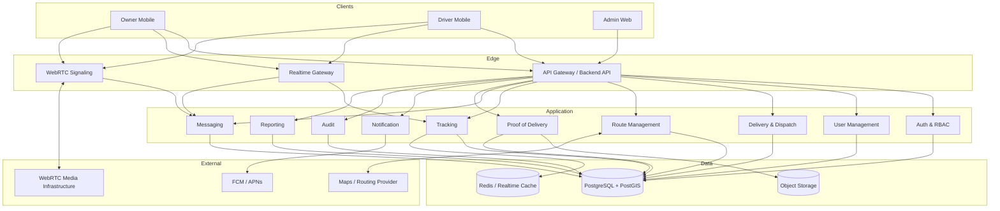
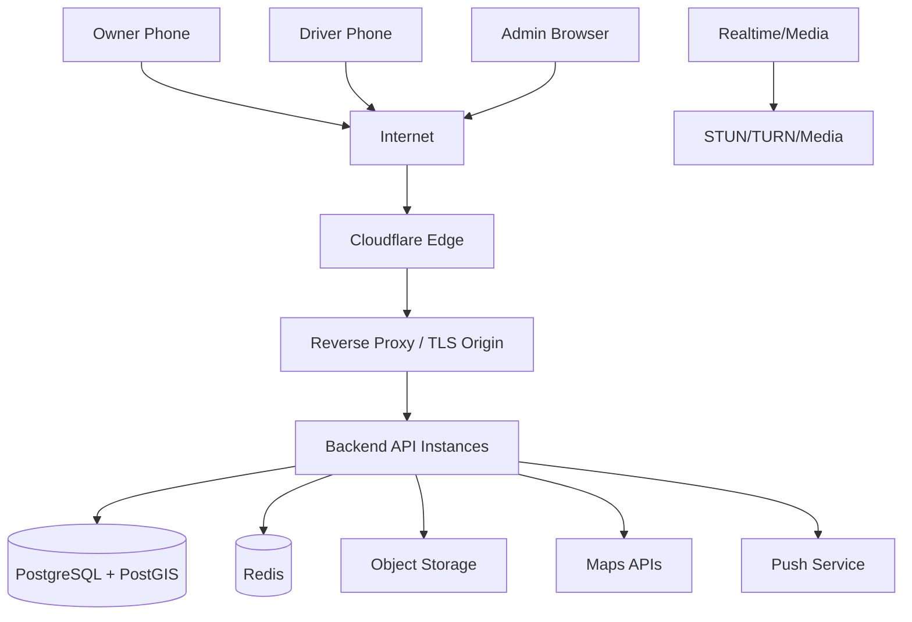
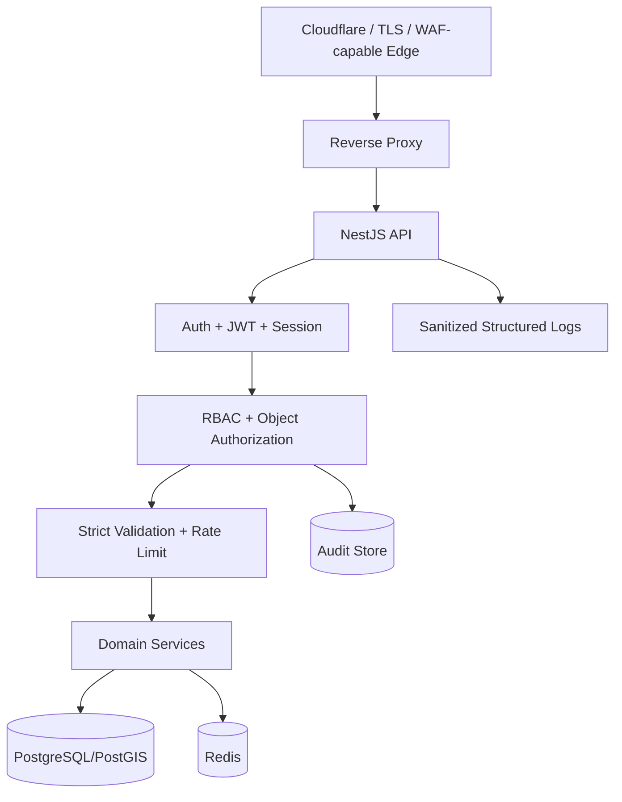
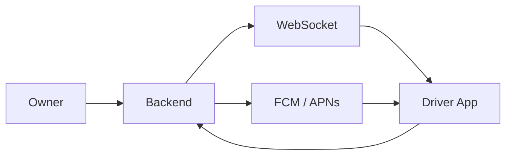
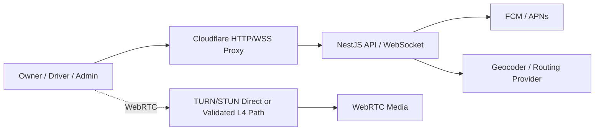

# System Architecture

## 1. Recommended logical architecture



## 2. Deployment topology



### Repository Organization (Polyrepo Architecture)
The overall Distribution Management System is developed under a **Polyrepo (Multi-Repository)** strategy:
- **Backend Service (This Repository):** Standalone NestJS Modular Monolith API and Realtime Gateway.
- **Admin Web Client:** Standalone browser SPA repository consuming REST and WebSocket contracts.
- **Owner Mobile Client:** Standalone Flutter mobile repository consuming REST and WebSocket contracts.
- **Driver Mobile Client:** Standalone Flutter mobile repository consuming REST and WebSocket contracts.

Client applications consume backend contracts (OpenAPI 3.0 and WebSocket definitions) and are decoupled from backend source code.

## 3. Recommended modular backend

For the first production-capable version, use a **modular monolith** rather than many microservices. Keep modules separated in code and contracts:

```text
backend/
├── auth/
├── users/
├── drivers/
├── vehicles/
├── deliveries/
├── routes/
├── tracking/
├── communication/
├── notifications/
├── pod/
├── audit/
├── reporting/
└── integrations/
    ├── maps/
    ├── push/
    └── realtime/
```

This avoids early operational complexity while allowing tracking/realtime workers to be extracted later.

## 4. Mapping & routing strategy

For the cost-constrained student project, use an **OSM-based mapping direction as the preferred evaluation path**.

Separate the concerns:

1. Map data/tiles.
2. Map rendering.
3. Routing engine.
4. Backend route-optimization/business rules.

Current candidates:

- Web/Admin map renderer: Leaflet.
- Flutter Mobile: Flutter-compatible OSM map library.
- Routing engine: OSRM candidate.
- Alternative: openrouteservice or another provider.
- Google Maps: alternative if coverage, reliability, navigation/traffic UX, or total cost proves more suitable.

Keep a `MapsProvider` / `RoutingService` abstraction in the backend. Do not invoke a routing service for every GPS ping.

## 5. GPS strategy without vehicle IoT

The driver's phone is the source of location:

```text
Phone GPS -> location service -> Driver App -> Backend -> Owner Realtime Map
```

Store:

- latitude
- longitude
- accuracy
- timestamp
- speed (if available)
- heading (if available)
- device/source metadata where permitted

Adaptive policy is recommended, e.g. distance threshold + minimum time interval + motion state, rather than a fixed extremely high-frequency timer.

## 6. Realtime architecture

Separate realtime concerns:

### Business realtime
WebSocket for:

- location updates to Owner
- driver status
- delivery events
- chat
- route changes
- notifications

### Voice/video
WebRTC for media. Backend manages authentication, authorization, session creation, signaling, and audit metadata; actual media should not be relayed through ordinary REST endpoints.

## 7. Offline strategy

Driver app should cache the active delivery and recent route data. Critical events use an outbox queue:

```text
Local event queue
   ↓
Retry with exponential backoff
   ↓
Backend acknowledgement
   ↓
Mark synchronized
```

Idempotency key should be attached to status/POD submissions.

## 8. Scalability boundaries

Scale independently when needed:

1. API workers
2. Realtime gateway
3. Location ingestion workers
4. Route calculation workers
5. WebRTC/TURN/media infrastructure

Database remains the transactional source of truth; Redis should not become the only source of business records.


## 9. Backend/security baseline

All client surfaces use the same backend security boundary:

```text
Owner Mobile ─┐
Driver Mobile ├─ HTTPS/WSS ─ Cloudflare ─ Reverse Proxy ─ NestJS
Admin Web ────┘
```

Required controls:

- JWT authentication with short-lived access token and refresh lifecycle.
- Secure signing/encryption keys from deployment secret management.
- Explicit CORS allowlist.
- Rate limiting.
- Strict schema validation.
- ORM/parameterized query access.
- Object-level authorization.
- Security headers for web.
- Structured audit/security/application/error logs with sanitization.
- No credentials, tokens, keys, or E2EE plaintext in logs.
- E2EE chat and secured WebRTC media for private communication.

Cloudflare is an edge transport/security layer, not a replacement for origin authentication and application authorization.

## 10. Security architecture layers



## 11. Session and device architecture

The backend maintains a session/device layer independent of short-lived access tokens. Revocation must be checked for authenticated API and realtime channels according to the chosen cache/DB strategy.

```text
User
 └── Device Session
      ├── refresh token/session identifier
      ├── device metadata
      ├── created/last-seen
      └── revoked state
```

## 12. Media/security boundary

Business backend does not carry raw voice/video through ordinary REST. It authenticates and authorizes the session, performs WebRTC signaling, and issues short-lived scoped media credentials. Media transport uses WebRTC security; E2EE media requirements are evaluated separately when an SFU is introduced.

## 13. Storage security boundary

Application data, encrypted backups, and object storage are separate trust boundaries. Public bucket/object access is prohibited by default. Access should use authorization and temporary/signed retrieval where appropriate.


## 9. Network topology for Cloudflare and WebRTC

HTTP API and WebSocket traffic may use Cloudflare proxying, while TURN/STUN/media connectivity must use a network path that actually supports the required protocols.

```text
api.example.com  ── Cloudflare Proxy ──> Reverse Proxy ──> NestJS
ws.example.com   ── Cloudflare Proxy ──> WebSocket Gateway
turn.example.com ── DNS Only / validated UDP path ──> TURN
                                                   └──> WebRTC peers/media
```

The architecture must not assume that ordinary Cloudflare HTTP proxying carries arbitrary UDP. If a Cloudflare product that supports the required UDP/media traffic is later selected, its specific configuration shall be validated separately.

## 10. Mobile background tracking

Driver location collection is constrained by Android/iOS lifecycle and permission policies. Active delivery tracking shall use the platform-supported background mechanisms, including Android Foreground Service where required and appropriate iOS Core Location background capability. The architecture shall treat tracking as best-effort under OS restrictions and include reconnect, stale-location detection, and graceful degradation.

## 11. Mapping, geocoding, and routing separation

```text
Address text
   ↓
Geocoding Provider
   ↓
Lat/Lng
   ↓
Routing Engine
   ↓
Distance / Duration / Geometry
   ↓
Backend Route Optimization
   ↓
Owner / Driver Map UI
```

Map rendering, geocoding, routing, and business-level stop optimization remain separate adapters. Candidate providers may change without changing domain logic.

## 12. Offline conflict architecture

```text
Driver Offline
     ↓
Local Outbox
     ↓
Retry + Idempotency
     ↓
Server validates current state
     ├── Valid transition → Apply
     └── Conflict → Preserve event/POD + Exception Review
```

The server remains authoritative, but conflicting evidence is preserved rather than silently discarded.

## 13. Resource profiles

### Capstone staging baseline

- 2 vCPU
- 2 GB RAM
- 30 GB SSD/NVMe
- Docker
- NestJS
- PostgreSQL/PostGIS
- Redis
- Reverse proxy

Avoid co-locating self-hosted OSRM datasets and TURN/media infrastructure on the same 2 GB staging node unless measured and explicitly validated.

### Larger / media-routing node

Use a separate or larger host when self-hosted routing data, TURN, or media infrastructure is introduced.


## 10. Mobile Wake-Up Architecture

WebSocket is used while a mobile client has an active connection. When the Driver socket is unavailable, the backend relies on platform push infrastructure to deliver a wake-up/call notification and keeps the authoritative pending request in server state.



The push channel does not replace server-side session state and is not treated as a guarantee of arbitrary background execution.

## 11. Routing and Resource Boundaries

- `<= 5` stops may use exhaustive permutation as a bounded baseline.
- `> 5` stops use heuristic/engine-assisted optimization.
- Route optimization must not consume uncontrolled CPU in the synchronous API path.
- Self-hosted OSRM and TURN are resource-isolated unless measured safe.


## 12. External Network Boundaries



The ordinary Cloudflare proxy path is for supported HTTP/HTTPS/WSS traffic. TURN/STUN is a separate media-network path and is not assumed to work through normal HTTP proxying.

## 13. Resource Isolation Rules

For the 2 vCPU / 2 GB Capstone staging baseline, avoid assuming that NestJS + PostgreSQL/PostGIS + Redis + self-hosted OSRM + TURN can safely coexist. Routing/media components should be external, separately hosted, or introduced only after measured resource validation.

## 14. Mobile Lifecycle Rules

Background GPS and mobile wake-up are platform-managed capabilities. The architecture must include platform-specific location service/permission handling and push fallback rather than relying on a permanently alive WebSocket or Dart timer.
