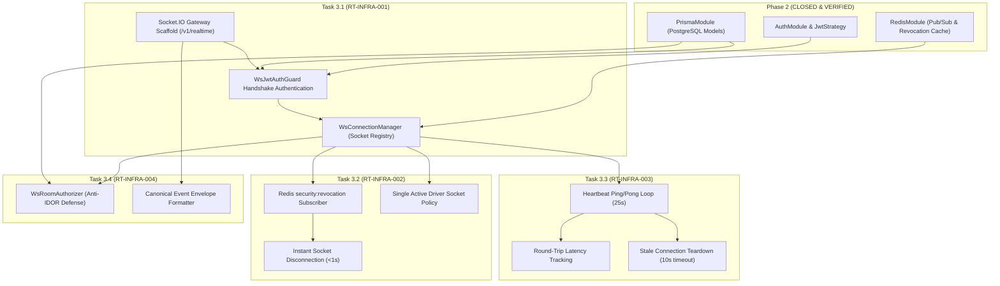

# Phase 3: Realtime Infrastructure, WebSocket Gateway, Session Heartbeat & Connection Revocation — Task Breakdown

**Version:** 1.0.0  
**Status:** READY FOR REVIEW / IMPLEMENTATION  
**Date:** 2026-09-02  
**Target Milestone:** Phase 3 Execution

---

## 1. Task Breakdown Matrix

| Task ID | Task Title | Primary Components | Dependencies | Test Coverage |
|---|---|---|---|---|
| **`RT-INFRA-001`** | WebSocket Gateway Scaffold & JWT Handshake Authentication | `realtime.gateway.ts`, `ws-jwt-auth.guard.ts`, `realtime-envelope.dto.ts`, `ws-connection-manager.service.ts` | Phase 2 Auth Module, Redis Module | `ws-auth-handshake.e2e-spec.ts` |
| **`RT-INFRA-002`** | Redis Revocation Listener, Instant Socket Teardown & Single Driver Socket | `ws-connection-manager.service.ts`, `realtime.gateway.ts` | `RT-INFRA-001`, Redis Pub/Sub | `ws-instant-revocation.e2e-spec.ts`, `ws-driver-socket.e2e-spec.ts` |
| **`RT-INFRA-003`** | Heartbeat Ping/Pong, Latency Tracking & Stale Socket Teardown | `realtime.gateway.ts`, `ws-connection-manager.service.ts` | `RT-INFRA-001` | `ws-heartbeat-teardown.e2e-spec.ts` |
| **`RT-INFRA-004`** | Channel / Room Authorization (Anti-IDOR Defense) & Event Envelope | `ws-room-authorizer.service.ts`, `realtime.gateway.ts`, `join-room.dto.ts` | `RT-INFRA-001`, Prisma Database Models | `ws-room-authorization.e2e-spec.ts`, `ws-event-envelope.e2e-spec.ts` |

---

## 2. Dependency Map & Critical Path

**Critical Path:**
`Phase 2 Base` $\rightarrow$ `Task 3.1 (WS Gateway & Handshake Auth)` $\rightarrow$ `Task 3.2 (Redis Revocation & Single Driver Socket)` $\rightarrow$ `Task 3.3 (Heartbeat & Latency)` $\rightarrow$ `Task 3.4 (Room Authorization Anti-IDOR)`.

---

## 3. Test Strategy & Verification Matrix

| Test Suite | Purpose & Verification Scope | Target File |
|---|---|---|
| **WS Handshake Auth** | Verifikasi handshake JWT, token missing/expired/tampered rejection, revocation check di Redis, dan account status `ACTIVE`. | `test/realtime/ws-auth-handshake.e2e-spec.ts` |
| **Instant Revocation** | Verifikasi socket yang sedang terhubung langsung diputus seketika saat event `USER_REVOKED` / `DEVICE_REVOKED` dipancarkan di Redis. | `test/realtime/ws-instant-revocation.e2e-spec.ts` |
| **Single Driver Socket** | Verifikasi koneksi kedua dari Driver yang sama otomatis memutus koneksi pertama dengan reason `SUPERSEDED_BY_NEW_LOGIN`. | `test/realtime/ws-driver-socket.e2e-spec.ts` |
| **Heartbeat & Stale Teardown** | Verifikasi pengiriman ping berkala (25s), perhitungan latency saat pong diterima, dan pemutusan otomatis socket zombie saat timeout 10s. | `test/realtime/ws-heartbeat-teardown.e2e-spec.ts` |
| **Room Authorization (Anti-IDOR)** | Verifikasi penolakan Driver A mencoba subscribe room Delivery Driver B (`ROOM_ACCESS_DENIED`) dan penolakan Driver join `fleet:monitoring`. | `test/realtime/ws-room-authorization.e2e-spec.ts` |
| **Event Envelope & QoS** | Verifikasi kepatuhan format seluruh event yang dipancarkan server terhadap skema canonical envelope. | `test/realtime/ws-event-envelope.e2e-spec.ts` |

---

## 4. Risks & Mitigations

| Risiko | Tingkat | Dampak | Strategi Mitigasi |
|---|:---:|---|---|
| **Redis Server Down** | Medium | Event broadcast multi-instance dan revocation event tidak terkirim via pub/sub. | Gateway beroperasi dalam mode fail-secure: local revocation check tetap berjalan, dan saat Redis reconnect, gateway otomatis resubscribe. |
| **Mobile Network Drop / Zombie Socket** | High | Socket tetap terbuka di server mengonsumsi memory dan memblokir login baru Driver. | Protokol Heartbeat (25s interval, 10s timeout) otomatis mendeteksi ketiadaan respons pong dan melakukan pemutusan paksa (*stale teardown*). |
| **Cross-Driver Snooping (IDOR di WS)** | Critical | Driver A mendengarkan pembaruan rute/POD/lokasi milik Driver B. | Pemeriksaan izin ketat di `WsRoomAuthorizerService` sebelum socket diizinkan bergabung ke `delivery:<deliveryId>`. |
| **WebSocket DoS / Message Flooding** | High | Client mengirim ratusan frame besar per detik membebani server. | Batas ukuran frame maksimum 32 KB dan pembatasan frekuensi inbound rate limit (1 update/sec untuk GPS). |

---

## 5. Scope Boundary (MVP vs Post-MVP)

- **Termasuk dalam Phase 3 (MVP Realtime Core):**
  - Socket.IO gateway pada `/v1/realtime` dengan handshake JWT terproteksi.
  - Listener Redis Pub/Sub untuk instant revocation pemutusan koneksi <1s.
  - Penegakan Single Active Socket untuk Driver.
  - Protokol Heartbeat ping-pong, pelacakan latency, dan stale connection teardown.
  - Otorisasi room anti-IDOR (`delivery:<id>`, `conversation:<id>`, `fleet:monitoring`).
  - Canonical Realtime Event Envelope formatter.
- **Dikecualikan / Fase Lanjutan:**
  - Streaming GPS ingestion & map projection (Phase 4: Telemetry & Fleet Tracking).
  - Enkripsi chat payload E2EE Double Ratchet (Phase 7: Communication).
  - WebRTC DTLS-SRTP Audio/Video streaming (Phase 7: Communication).

---

## 6. Implementation Order & Gates

1. **Gate 3.1:** Implementasi Task 3.1 $\rightarrow$ `npm run test:e2e` for `ws-auth-handshake` GREEN $\rightarrow$ Commit `feat(realtime): implement Task 3.1 WebSocket gateway and JWT handshake authentication`.
2. **Gate 3.2:** Implementasi Task 3.2 $\rightarrow$ `ws-instant-revocation` and `ws-driver-socket` GREEN $\rightarrow$ Commit `feat(realtime): implement Task 3.2 Redis revocation listener and single driver socket policy`.
3. **Gate 3.3:** Implementasi Task 3.3 $\rightarrow$ `ws-heartbeat-teardown` GREEN $\rightarrow$ Commit `feat(realtime): implement Task 3.3 heartbeat latency tracking and stale socket teardown`.
4. **Gate 3.4:** Implementasi Task 3.4 $\rightarrow$ `ws-room-authorization` and `ws-event-envelope` GREEN $\rightarrow$ Commit `feat(realtime): implement Task 3.4 room authorization and event envelope`.
5. **Phase 3 Final Gate:** Full test suite (all 24+ test suites) GREEN, `npm run build` clean (exit code 0), author `PHASE-3-IMPLEMENTATION-REPORT.md`.
