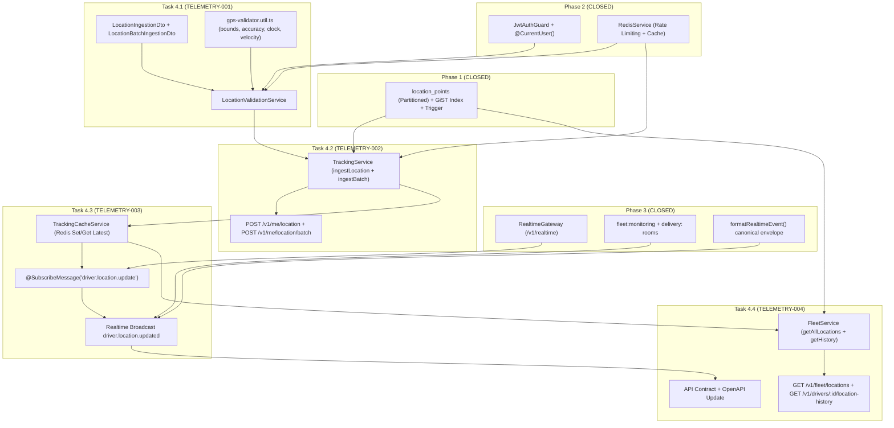

# Phase 4: Telemetry, GPS Streaming & Fleet Monitoring — Task Breakdown

**Version:** 1.0.0
**Status:** APPROVED — READY FOR IMPLEMENTATION
**Date:** 2026-09-02
**Target Milestone:** Phase 4 Execution

---

## 1. Task Breakdown Matrix

| Task ID | Task Title | Primary Components | Dependencies | Test Coverage |
|---|---|---|---|---|
| **`TELEMETRY-001`** | GPS Validation DTOs, Utility & Validation Pipeline | `location-ingestion.dto.ts`, `location-batch-ingestion.dto.ts`, `gps-validator.util.ts`, `LocationValidationService` | Phase 1 DB Schema, Phase 2 Auth | `gps-validation.spec.ts` |
| **`TELEMETRY-002`** | REST Telemetry Ingestion & Batch Offline Ingestion | `tracking.service.ts`, `tracking.controller.ts`, `tracking.module.ts` | `TELEMETRY-001`, Prisma PostGIS, Redis Rate Limit | `location-rest-ingest.e2e-spec.ts` |
| **`TELEMETRY-003`** | Redis Telemetry Cache & Realtime Live Map Streaming | `tracking-cache.service.ts`, `RealtimeGateway` (modified), WS event handler | `TELEMETRY-002`, Phase 3 Realtime Gateway | `ws-telemetry-streaming.e2e-spec.ts` |
| **`TELEMETRY-004`** | Fleet Live Monitoring & Driver Location History APIs + API Docs | `fleet.service.ts`, `fleet.controller.ts`, `fleet.module.ts`, `location-history-query.dto.ts`, API docs | `TELEMETRY-003`, PostGIS Spatial Queries | `fleet-monitoring.e2e-spec.ts` |

---

## 2. Dependency Map & Critical Path

**Critical Path:** Phase 2 + Phase 1 + Phase 3 Base → `TELEMETRY-001` → `TELEMETRY-002` → `TELEMETRY-003` → `TELEMETRY-004`

---

## 3. Test Strategy & Verification Matrix

| Test Suite | Purpose & Coverage | File | Gate |
|---|---|---|---|
| **GPS Validation Unit Tests** | Bounds check, accuracy filter, clock skew validation, velocity anomaly detection, edge cases | `test/tracking/gps-validation.spec.ts` | Gate 4.1 |
| **REST Telemetry Ingestion (E2E)** | Single/batch ingestion, anti-spoofing, rate limiting, role guard, error codes | `test/tracking/location-rest-ingest.e2e-spec.ts` | Gate 4.2 |
| **Realtime Telemetry Streaming (E2E)** | WS event ingestion, Redis cache update, live broadcast, out-of-order guard, anomaly no-broadcast | `test/tracking/ws-telemetry-streaming.e2e-spec.ts` | Gate 4.3 |
| **Fleet Monitoring & Anti-IDOR (E2E)** | Fleet live map, location history, role access guard, Driver cross-access rejection | `test/tracking/fleet-monitoring.e2e-spec.ts` | Gate 4.4 |

---

## 4. Security Test Matrix

| Scenario | Expected Outcome |
|---|---|
| Driver sends telemetry with mismatched `driverId` in body | 403 DRIVER_IDENTITY_MISMATCH |
| Owner/Admin attempts telemetry submission | 403 FORBIDDEN |
| Driver accesses `GET /v1/fleet/locations` | 403 FLEET_ACCESS_DENIED |
| Driver accesses another driver's location history | 403 RESOURCE_FORBIDDEN |
| `latitude > 90` or `longitude > 180` | 400 INVALID_COORDINATES |
| `accuracyM = 75` (threshold 50) | 422 GPS_ACCURACY_BELOW_THRESHOLD |
| `recorded_at` = 10 minutes in the future | 422 TIMESTAMP_FUTURE |
| `recorded_at` = 2 hours ago | 422 TIMESTAMP_STALE |
| Velocity jump: 500 m in 2 seconds | 201 Created, `validation_status = ANOMALY_VELOCITY`, NOT broadcast |
| Rate limit: 2 requests in <1s | 429 RATE_LIMIT_EXCEEDED (second request) |
| Batch with 51 points | 400 BATCH_TOO_LARGE |
| Unauthenticated request | 401 UNAUTHORIZED |
| Revoked session token | 401 SESSION_REVOKED (via WsJwtAuthGuard / JwtAuthGuard) |

---

## 5. API Endpoints Planned (Phase 4)

| Method | Path | Role Guard | Description |
|---|---|---|---|
| `POST` | `/v1/me/location` | DRIVER only | Single GPS telemetry ingestion |
| `POST` | `/v1/me/location/batch` | DRIVER only | Offline batch GPS sync (max 50) |
| `GET` | `/v1/fleet/locations` | ADMIN, SUPER_ADMIN, OWNER | Real-time fleet map: all active drivers latest positions |
| `GET` | `/v1/drivers/:id/location-history` | ADMIN, SUPER_ADMIN, OWNER | Driver GPS breadcrumb history with time range filter |

**WebSocket Events:**

| Direction | Event Name | Description |
|---|---|---|
| Client → Server | `driver.location.update` | Driver submits GPS via WebSocket |
| Server → Client | `driver.location.updated` | Server broadcasts validated GPS to fleet/delivery rooms |

---

## 6. Scope Boundary (MVP vs Post-MVP)

### Included in Phase 4 (MVP Realtime Tracking Core)
- GPS validation pipeline (bounds, accuracy, clock skew, velocity anomaly)
- `POST /v1/me/location` (single ingestion)
- `POST /v1/me/location/batch` (offline outbox max 50)
- Redis latest-location cache per driver
- WebSocket `driver.location.update` handler
- Realtime broadcast `driver.location.updated` to `fleet:monitoring` + `delivery:<id>`
- `GET /v1/fleet/locations` (Owner/Admin)
- `GET /v1/drivers/:id/location-history` (Owner/Admin)
- API Contract documentation

### Excluded / Deferred to Later Phases
- Automatic geofence arrival/departure detection → Phase 6
- Route optimization based on GPS → Phase 5
- GPS-based ETA recalculation → Phase 5
- Advanced ML anomaly scoring → Phase 10
- Driver operational status auto-update from GPS → Phase 6
- GPS data retention purge policy enforcement → Phase 10

---

## 7. Implementation Gates & Commit Style

| Gate | Condition | Expected Commit |
|---|---|---|
| Gate 4.1 | `gps-validation.spec.ts` GREEN | `feat(tracking): add gps validation pipeline and dto` |
| Gate 4.2 | `location-rest-ingest.e2e-spec.ts` GREEN | `feat(tracking): add telemetry rest ingestion endpoint` |
| Gate 4.3 | `ws-telemetry-streaming.e2e-spec.ts` GREEN | `feat(tracking): add redis cache and realtime gps broadcast` |
| Gate 4.4 | `fleet-monitoring.e2e-spec.ts` GREEN + API docs written | `feat(fleet): add fleet monitoring and location history api` |
| Phase 4 Final | All 27+ suites GREEN + build clean | `docs(report): add phase 4 implementation report` |

---

## 8. Risks & Mitigations

| Risiko | Tingkat | Mitigasi |
|---|---|---|
| PostGIS partition out-of-range (miss) | Low | `location_points_default` menangkap row, observability alert via health check |
| Redis cache stale after driver disconnect | Low | TTL 24h + overwrite hanya jika `recorded_at` lebih baru |
| Velocity false positive (tunnel, bridge) | Medium | Hanya mark `ANOMALY_VELOCITY`, tetap simpan ke DB untuk audit |
| Race condition: dual batch ingestion | Medium | Per-driver Redis batch rate limit mencegah paralel submission |
| WebSocket event flooding | High | Rate limit 1 event/sec per driver via Redis incr |
