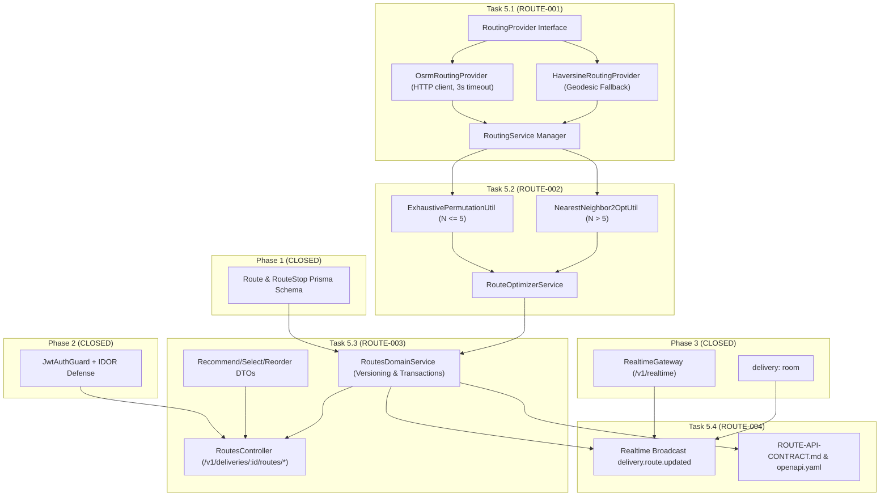

# Phase 5: Route Optimization, Routing Provider & 2-Opt — Task Breakdown

**Version:** 1.0.0
**Status:** APPROVED — READY FOR IMPLEMENTATION
**Date:** 2026-09-02
**Target Milestone:** Phase 5 Execution

---

## 1. Task Breakdown Matrix

| Task ID | Task Title | Primary Components | Dependencies | Test Coverage |
|---|---|---|---|---|
| **`ROUTE-001`** | Routing Provider Abstraction & Distance Matrix Engine | `routing-provider.interface.ts`, `osrm-routing.provider.ts`, `haversine-routing.provider.ts`, `routing.service.ts` | Phase 1 PostGIS | `routing-provider.spec.ts` |
| **`ROUTE-002`** | Route Optimization Engine ($N \le 5$ Permutation & $N > 5$ 2-Opt) | `exhaustive-permutation.util.ts`, `nearest-neighbor-2opt.util.ts`, `route-optimizer.service.ts` | `ROUTE-001` | `route-optimizer.spec.ts` |
| **`ROUTE-003`** | Route Management & Recommendation REST Endpoints | DTOs (`recommend-route.dto.ts`, `select-route.dto.ts`, `manual-reorder.dto.ts`), `routes-domain.service.ts`, `routes.controller.ts`, `routes.module.ts` | `ROUTE-002`, Phase 2 Auth/IDOR | `routes-rest.e2e-spec.ts` |
| **`ROUTE-004`** | Realtime Route Broadcast, Living API Contracts & OpenAPI Finalization | `RealtimeGateway` (`delivery.route.updated`), `ROUTE-API-CONTRACT.md`, `openapi.yaml` | `ROUTE-003`, Phase 3 Realtime Gateway | `ws-route-broadcast.e2e-spec.ts` |

---

## 2. Dependency Map & Critical Path

**Critical Path:** `ROUTE-001` $\rightarrow$ `ROUTE-002` $\rightarrow$ `ROUTE-003` $\rightarrow$ `ROUTE-004`.

---

## 3. Test Strategy & Verification Matrix

| Test Suite | Purpose & Coverage | Target File |
|---|---|---|
| **Routing Provider Unit Tests** | Matrix calculation, OSRM HTTP success, OSRM timeout $\rightarrow$ Haversine fallback, Haversine geodesic accuracy | `test/routes/routing-provider.spec.ts` |
| **Route Optimizer Unit Tests** | $N=3, 5$ Exhaustive permutation global optimum, $N=8$ 2-Opt improvement, tie-breaking determinism | `test/routes/route-optimizer.spec.ts` |
| **Routes REST API (E2E)** | Recommend route, select route, manual reorder, version increment, IDOR rejection (Driver A to Delivery B) | `test/routes/routes-rest.e2e-spec.ts` |
| **Realtime Route Broadcast (E2E)** | Route selection/reorder triggers `delivery.route.updated` event to room `delivery:<deliveryId>` | `test/routes/ws-route-broadcast.e2e-spec.ts` |
