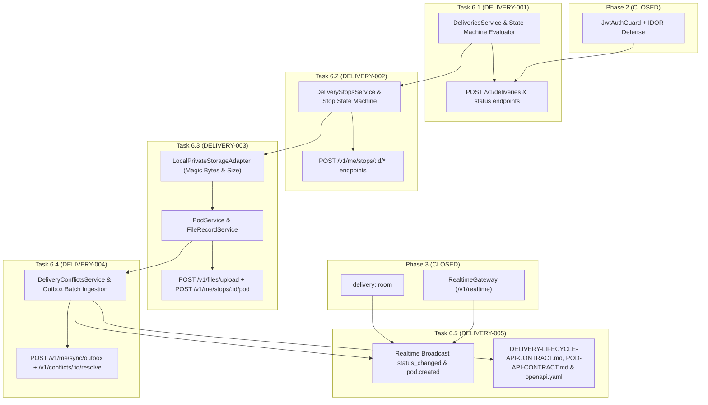

# Phase 6: Delivery Lifecycle, POD & Conflicts — Task Breakdown

**Version:** 1.0.0
**Status:** APPROVED — READY FOR IMPLEMENTATION
**Date:** 2026-09-02
**Target Milestone:** Phase 6 Execution

---

## 1. Task Breakdown Matrix

| Task ID | Task Title | Primary Components | Dependencies | Test Coverage |
|---|---|---|---|---|
| **`DELIVERY-001`** | Delivery Management & State Machine Engine | `DeliveriesService`, `deliveries.controller.ts`, DTOs (`create-delivery`, `assign-delivery`, `status-update`), `evaluateDeliveryCompletion` | Phase 2 Auth, Phase 4 Telemetry | `delivery-state-machine.e2e-spec.ts` |
| **`DELIVERY-002`** | DeliveryStop Lifecycle & Transition Subsystem | `DeliveryStopsService`, `stop-status.dto.ts`, `DeliveryEvent` outbox logger | `DELIVERY-001` | `stop-lifecycle.e2e-spec.ts` |
| **`DELIVERY-003`** | Secure File Upload & Proof of Delivery (POD) Service | `PodModule`, `PodService`, `FileStorageService`, `LocalPrivateStorageAdapter`, `submit-pod.dto.ts` | `DELIVERY-002`, File Storage | `pod-upload.e2e-spec.ts` |
| **`DELIVERY-004`** | Offline Outbox Sync & Deterministic Conflict Engine | `DeliveryConflictsService`, `conflicts.controller.ts`, `outbox-sync.dto.ts`, `resolve-conflict.dto.ts` | `DELIVERY-003` | `offline-conflicts.e2e-spec.ts` |
| **`DELIVERY-005`** | Realtime Status Propagation & Living API Contracts | `RealtimeGateway` events (`delivery.status_changed`, `delivery.stop.status_changed`, `delivery.pod.created`), API contracts & OpenAPI finalization | `DELIVERY-004`, Phase 3 Realtime | `ws-delivery-realtime.e2e-spec.ts` |

---

## 2. Dependency Map & Critical Path

**Critical Path:** `DELIVERY-001` $\rightarrow$ `DELIVERY-002` $\rightarrow$ `DELIVERY-003` $\rightarrow$ `DELIVERY-004` $\rightarrow$ `DELIVERY-005`.
