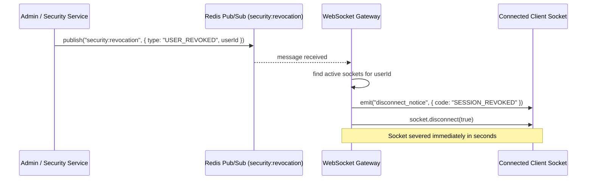

# Phase 3: Realtime Infrastructure, WebSocket Gateway, Session Heartbeat & Connection Revocation — Design Spec

**Document Version:** 1.0.0  
**Target Milestone:** Phase 3 Implementation Ready  
**Date:** 2026-09-02  
**Author:** AI Engineering Agent (BE & Security Lead)

---

## 1. Executive Summary & Goals

Phase 3 membangun fondasi infrastruktur komunikasi dua arah (bidirectional realtime) berbasis **Socket.IO** dan **Redis Pub/Sub**, dilengkapi dengan mekanisme handshake autentikasi JWT terproteksi, penegakan *Single Active Socket* untuk Driver, otorisasi room/channel anti-IDOR, pemutusan koneksi instan (*instant revocation* via Redis event), protokol heartbeat/latency tracking, serta pembersihan koneksi usang (*stale socket teardown*).

### Core Objectives of Phase 3:
1. **WebSocket Authentication & Handshake (`RT-INFRA-001`):** Autentikasi handshake menggunakan JWT access token (`HS256`, 15m), validasi status akun `ACTIVE`, pengikatan metadata (`userId`, `deviceId`, `sessionId`, `role`, `driverId`), dan penolakan instan terhadap token yang sudah dicabut di Redis.
2. **Instant Connection Revocation (`RT-INFRA-002`):** Integrasi listener Redis Pub/Sub pada channel `security:revocation` untuk memutus koneksi WebSocket aktif dalam hitungan detik ketika status user dinonaktifkan, device dicabut, atau token family di-revoke.
3. **Heartbeat & Stale Socket Teardown (`RT-INFRA-003`):** Protokol ping-pong (interval 25s, timeout 10s), pengukuran round-trip latency ($\Delta t$), dan pemutusan otomatis koneksi zombie/stale akibat gangguan jaringan mobile.
4. **Room Authorization & Anti-IDOR Defense:** Penegakan izin berlangganan room (`delivery:<id>`, `conversation:<id>`, `fleet:monitoring`) sehingga Driver A tidak dapat menguping data Driver B.
5. **Canonical Event Envelope & QoS Semantics:** Standarisasi struktur payload event realtime beserta klasifikasi delivery semantics (*Best Effort* vs *At-Least-Once*).

---

## 2. WebSocket Authentication & Handshake Protocol

### 2.1 Handshake Transport
Client mobile (Owner/Driver) dan Admin Web terhubung ke WebSocket Gateway pada namespace `/v1/realtime` melalui protokol WSS:
- **Metode Utama (Socket.IO Auth Object):**
  ```javascript
  const socket = io('/v1/realtime', {
    auth: { token: 'Bearer <jwt_access_token>' },
    transports: ['websocket'],
  });
  ```
- **Metode Alternatif (Query Param):** `wss://host/v1/realtime?token=<jwt_access_token>`.

### 2.2 Handshake Validation Pipeline
Setiap koneksi yang masuk melewati `WsJwtAuthGuard` / Handshake Middleware:
1. **Format Check:** Ekstraksi token dari `handshake.auth.token` atau `handshake.query.token`. Jika kosong $\rightarrow$ Tolak dengan error `AUTH_REQUIRED`.
2. **Cryptographic Signature & Claims Check:**
   - Verifikasi tanda tangan dengan algoritma strictly `HS256` dan secret `JWT_SECRET_OR_KEY`.
   - Validasi klaim: `iss === 'dms-api'`, `aud === 'dms-clients'`, `type === 'ACCESS_TOKEN'`, dan masa berlaku (`exp`) masih aktif.
3. **Redis Revocation Check (Fast Memory Lookup):**
   - Periksa `EXISTS revoked:session:<sessionId>` dan `EXISTS revoked:user:<userId>`.
   - Jika key ditemukan $\rightarrow$ Tolak dengan error `TOKEN_REVOKED`.
4. **Database State Verification:**
   - Ambil data user dari PostgreSQL: pastikan `status === 'ACTIVE'` dan `role.code === payload.role`.
   - Jika user tidak ditemukan, akun `SUSPENDED`/`DISABLED`, atau role telah berubah $\rightarrow$ Tolak dengan error `ACCOUNT_INACTIVE` atau `ROLE_CHANGED`.
5. **Context Binding:**
   - Jika lolos seluruh validasi $\rightarrow$ Ikat metadata ke dalam socket context:
     ```typescript
     socket.data = {
       userId: user.id,
       username: user.username,
       role: user.role.code,
       permissions: userPermissions,
       deviceId: payload.deviceId,
       sessionId: payload.sessionId,
       driverId: user.driver?.id || null,
       joinedRooms: new Set<string>(),
       lastPingAt: Date.now(),
       latencyMs: 0,
     };
     ```

---

## 3. Connection Management & Role Policies

### 3.1 Connection Manager (`WsConnectionManagerService`)
Backend memelihara struktur data pelacakan koneksi di memori:
- `userSockets`: `Map<string, Set<string>>` (userId $\rightarrow$ Set of socketIds)
- `sessionSockets`: `Map<string, string>` (sessionId $\rightarrow$ socketId)
- `deviceSockets`: `Map<string, string>` (deviceId $\rightarrow$ socketId)
- `driverSockets`: `Map<string, string>` (driverId $\rightarrow$ socketId)

### 3.2 Driver Operational Single Socket Policy
- **Aturan:** Seorang Driver hanya diizinkan memiliki tepat **1 koneksi socket aktif** (`1 Driver = 1 Active Operational Socket`).
- **Penegakan:** Saat Driver terhubung dengan socket baru:
  1. Periksa apakah `driverSockets.has(driverId)`.
  2. Jika ada socket lama yang terdaftar $\rightarrow$ Kirim event `{ event: 'disconnect_notice', reason: 'SUPERSEDED_BY_NEW_LOGIN' }` ke socket lama dan lakukan `socket.disconnect(true)`.
  3. Daftarkan socket baru sebagai socket aktif.

### 3.3 Owner & Admin Policy
- Multi-socket diizinkan (maksimal 5 socket simultan per user, misalnya web dashboard pada PC, monitoring pada tablet, dan aplikasi mobile).

---

## 4. Redis Pub/Sub & Instant Connection Revocation

### 4.1 Redis Pub/Sub Adapter for Horizontal Scaling
- Menggunakan `@socket.io/redis-adapter` dengan Redis client dedicated (pubClient & subClient).
- Seluruh event broadcast room otomatis disinkronisasikan ke seluruh instance NestJS yang berjalan di cluster.

### 4.2 Instant Revocation Mechanism (`RT-INFRA-002`)
Ketika ada aksi administratif di layer HTTP (misal Admin menonaktifkan user, atau sistem mendeteksi token reuse), backend mempublikasikan event ke channel `security:revocation`:
```json
{
  "type": "USER_REVOKED" | "DEVICE_REVOKED" | "SESSION_REVOKED",
  "userId": "b8a34f89-8d7e-4a61-9c60-84a92c304d91",
  "deviceId": "550e8400-e29b-41d4-a716-446655440000",
  "sessionId": "6ba7b810-9dad-11d1-80b4-00c04fd430c8",
  "reason": "ACCOUNT_DISABLED" | "TOKEN_REUSE_DETECTED" | "ROLE_CHANGED",
  "timestamp": "2026-09-02T10:20:00.000Z"
}
```

**Alur Pemutusan Instan:**


---

## 5. Heartbeat, Latency Tracking & Stale Socket Teardown

### 5.1 Heartbeat Protocol (`RT-INFRA-003`)
1. **Ping Interval:** Server mengirimkan event `ping` setiap **25 detik** ke setiap socket yang terhubung:
   ```json
   { "serverTime": 1788349200000 }
   ```
2. **Pong Response:** Client merespons dengan event `pong`:
   ```json
   { "clientTime": 1788349200045, "pingServerTime": 1788349200000 }
   ```
3. **Latency Computation:** Server menghitung round-trip time:
   $$\Delta t = \text{Date.now()} - \text{pingServerTime}$$
   Menyimpan $\Delta t$ pada `socket.data.latencyMs` dan memperbarui `socket.data.lastPingAt = Date.now()`.

### 5.2 Stale Socket Teardown
- **Timeout Threshold:** 10 detik setelah `ping` dikirim (total 35 detik inaktivitas).
- Jika socket tidak merespons `pong` dalam 10 detik:
  1. Tandai socket sebagai *stale/zombie*.
  2. Catat audit log `SOCKET_STALE_TEARDOWN`.
  3. Panggil `socket.disconnect(true)` untuk membebaskan memory & file descriptors di server.

---

## 6. Channel / Room Authorization & IDOR Defense

Setiap client yang ingin mendengarkan topik/room tertentu wajib mengirim event `join_room`:
```json
{ "room": "delivery:del-12345" }
```

### 6.1 Authorization Policy Matrix

| Room Pattern | Roles Allowed | Authorization Rule (Anti-IDOR Defense) |
|---|---|---|
| `delivery:<deliveryId>` | `ADMIN`, `SUPER_ADMIN`, `OWNER`, `DRIVER` | Driver **hanya boleh bergabung** jika `delivery.driverId === socket.data.driverId`. Driver lain ditolak dengan error `ROOM_ACCESS_DENIED`. |
| `driver:location:<driverId>` | `ADMIN`, `SUPER_ADMIN`, `OWNER`, `DRIVER` | Driver hanya boleh memancarkan/mendengarkan lokasi miliknya sendiri. Owner/Admin dapat memonitor. |
| `conversation:<conversationId>` | `OWNER`, `DRIVER` | Hanya user yang terdaftar sebagai `ownerId` atau `driverId` pada percakapan tersebut yang diizinkan bergabung. |
| `fleet:monitoring` | `ADMIN`, `SUPER_ADMIN`, `OWNER` | Khusus manajemen armada. Role `DRIVER` **ditolak secara eksplisit**. |
| `emergency:broadcast` | All Authenticated | Terbuka untuk seluruh pengguna terotentikasi. |

---

## 7. Canonical Event Envelope & QoS Delivery Semantics

### 7.1 Canonical Event Envelope Schema
Seluruh event realtime yang dikirim oleh server wajib menggunakan struktur standar:
```typescript
export interface RealtimeEventEnvelope<T = any> {
  eventId: string;          // UUID v4
  event: string;            // Nama canonical event, e.g. "driver.location.updated"
  version: number;          // Schema version (default 1)
  timestamp: string;        // ISO-8601 UTC
  correlationId: string;    // Request/Trace UUID
  actor: {
    userId: string;
    role: string;
    deviceId?: string;
  };
  payload: T;
}
```

### 7.2 QoS & Delivery Semantics Classification

| Kategori Event | Event Name | QoS Semantics | Alasan Desain & Kebijakan |
|---|---|---|---|
| **GPS Telemetry** | `driver.location.updated` | Best Effort / At-Most-Once | Frekuensi tinggi (setiap 5 detik). Jika terjadi kongesti jaringan, paket koordinat lama boleh di-drop tanpa blocking. |
| **Delivery State** | `delivery.status_changed` | At-Least-Once | Kritis untuk operasional bisnis. Disinkronkan dengan event outbox PostgreSQL (`delivery_events`). |
| **Emergency SOS** | `emergency.created` | At-Least-Once | Kritis keselamatan nyawa. Server memancarkan broadcast ke seluruh admin/owner dengan ACK tracking. |
| **E2EE Chat** | `message.created` | At-Least-Once | Pesan terenkripsi. Client pengirim menunggu delivery receipt dari server. |
| **WebRTC Signaling** | `realtime.session.signal` | Best Effort / Transient | Sinyal Offer/Answer/ICE candidate yang hanya relevan selama sesi inisiasi panggilan aktif. |

---

## 8. Backpressure, Frame Limits & Rate Limiting

- **WebSocket Frame Size Limit:** Maksimal **32 KB** per payload message.
- **Inbound Message Rate Limiting:**
  - Telemetri Lokasi: Maksimal **1 update per detik** per socket.
  - Chat/Signaling: Maksimal **5 pesan per detik** per socket.
  - Pelanggaran memicu event `rate_limit_exceeded` dan pengabaian payload sementara.

---

## 9. Verification & Automated Test Matrix

| Test Suite | File | Skenario Uji Kunci |
|---|---|---|
| **WS Handshake & Auth** | `test/realtime/ws-auth-handshake.e2e-spec.ts` | Valid JWT handshake, missing token rejection, expired token rejection, forged signature rejection, revoked session/user rejection. |
| **Instant Revocation** | `test/realtime/ws-instant-revocation.e2e-spec.ts` | Socket terhubung $\rightarrow$ publish event Redis `USER_REVOKED` / `DEVICE_REVOKED` $\rightarrow$ socket diputus dalam hitungan detik $\rightarrow$ reconnect ditolak 401. |
| **Single Driver Socket** | `test/realtime/ws-driver-socket.e2e-spec.ts` | Driver terhubung di Socket 1 $\rightarrow$ connect Socket 2 $\rightarrow$ Socket 1 diputus otomatis dengan reason `SUPERSEDED_BY_NEW_LOGIN`. |
| **Heartbeat & Teardown** | `test/realtime/ws-heartbeat-teardown.e2e-spec.ts` | Ping 25s terkirim, pong merespons dan latency tercatat, simulasi client mati tanpa pong $\rightarrow$ socket diputus otomatis setelah timeout 10s. |
| **Room Authorization (Anti-IDOR)** | `test/realtime/ws-room-authorization.e2e-spec.ts` | Driver A join `delivery:<deliveryB>` ditolak `ROOM_ACCESS_DENIED`, Driver A join `fleet:monitoring` ditolak, Admin join sukses. |
| **Canonical Event Envelope** | `test/realtime/ws-event-envelope.e2e-spec.ts` | Memverifikasi struktur `eventId`, `timestamp`, `correlationId`, `actor`, dan `payload` pada seluruh event yang dipancarkan. |
